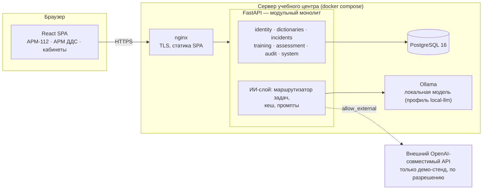

# АИскра — ИИ-тренажёр оператора 112 и диспетчера ДДС

Хакатон «Лидеры цифровой трансформации 2026», задача №9: Департамент ГОЧСиПБ Москвы, ГБУ «Система 112».

АИскра — учебная среда для операторов службы 112 и диспетчеров дежурно-диспетчерских служб (ДДС). Обучающийся работает в точной копии рабочих мест АРМ-112 и АРМ ДДС: принимает учебный вызов, разговаривает с ИИ-заявителем, заполняет карточку, ведёт статусы службы. Преподаватель собирает банк сценариев, проводит занятия, видит работу группы в реальном времени и получает отчёт с автооценкой. Система работает в изолированном контуре: ИИ — локальная модель или офлайн-режим, реальные вызовы и персональные данные не используются.

## Возможности

| Роль | Что делает |
|---|---|
| **Оператор 112** | журнал происшествий и карточка как в АРМ-112; учебный входящий вызов с ИИ-заявителем (текст, озвучка); адрес со справочником и картой; опросник классификатора и автоподбор служб; отработки, «проверена», «на доработку» |
| **Диспетчер ДДС** | журнал карточек своей службы с таймерами ожидания; решение «Принята / Не принята», статусы до «Работы завершены», номер наряда; IP-телефон: старший группы, заявитель, другие службы |
| **Преподаватель** | банк сценариев: генерация, легенда и эталон, прогон, правка, утверждение; занятия группой (112, ДДС, смешанные) с темпом вызовов; мониторинг на плитках; отчёт: автооценка по эталону, экспертная правка, тепловая карта, CSV и PDF; учебные материалы |
| **Обучающийся** | кабинет: назначенные занятия и вход в эмулятор своей роли, свои результаты с разбором ошибок и рекомендациями, справочная база |
| **Администратор** | пользователи и группы, настройки занятий по умолчанию, резервные копии и восстановление, состояние сервисов, журнал аудита и логи, импорт справочников |

Сквозной сценарий «вызов → карточка 112 → очередь ДДС → статусы → отчёт» — [docs/demo/M6_сквозной_сценарий.md](docs/demo/M6_сквозной_сценарий.md), скринкаст 3,5 мин — [docs/demo/АИскра_скринкаст.mp4](docs/demo/АИскра_скринкаст.mp4).

## Архитектура



- **Модульный монолит** с чистой архитектурой: модули не импортируют друг друга, связь — через порты и адаптеры в `aiskra/integration`; правила проверяет `import-linter` ([ADR-0001](docs/adr/0001-modular-monolith-clean-architecture.md)).
- **CQRS-lite**: команды и запросы — отдельные обработчики ([ADR-0002](docs/adr/0002-cqrs-lite.md)).
- **ИИ за портами**: задачи (генерация сценария, заявитель, старший группы, судья) назначаются провайдерам в `config/ai.yaml`; без модели система работает в детерминированном офлайн-режиме ([ADR-0003](docs/adr/0003-ports-adapters-ai.md)).
- **Один процесс API**, опрос раз в 5 с вместо WebSocket ([ADR-0005](docs/adr/0005-single-process-mvp.md)).
- Подробнее — [docs/architecture/overview.md](docs/architecture/overview.md), решения — [docs/adr](docs/adr/README.md).

## Стек

| Слой | Технологии |
|---|---|
| Бэкенд | Python 3.12+, FastAPI, SQLAlchemy 2 (async), Alembic, Pydantic 2, httpx |
| БД | PostgreSQL 16 (SQLite — для демо и тестов) |
| Фронтенд | React 18, TypeScript 5, Vite 5, TanStack Query 5, React Router 6, Leaflet |
| UI | собственная библиотека `packages/ui-kit` — стили АРМ-112/ДДС и кабинетов |
| ИИ | любой OpenAI-совместимый сервер: Ollama, vLLM, llama.cpp; внешний API — только на демо-стенде |
| Поставка | docker compose: nginx (TLS), backend, PostgreSQL, Ollama (по профилю) |

Полный перечень библиотек с версиями и лицензиями — [docs/LIBRARIES.md](docs/LIBRARIES.md).

## Быстрый запуск (docker compose)

Нужны Docker 24+ и docker compose v2. Сервер ТЗ: 6 ядер, 32 ГБ, без GPU.

```bash
cp .env.example .env
# в .env задайте AISKRA_BOOTSTRAP_ADMIN_PASSWORD (от 8 символов) и POSTGRES_PASSWORD
docker compose up --build -d
```

Откройте `https://localhost:8443` (адрес `http://…:8080` перенаправляет на HTTPS). Сертификат самоподписанный, браузер предупредит один раз; свой сертификат кладётся в том `tls`. Имя или IP сервера для сертификата — переменная `TLS_SAN`, например `DNS:aiskra.local,IP:10.0.0.5`.

Стенд для показа — справочники, адреса, 30 утверждённых сценариев, учётки ролей и группа — одной командой:

```bash
export AISKRA_DEMO_PASSWORD='пароль-демо-учёток'
make demo-seed-docker
```

Прошедшие занятия за две недели, чтобы аналитика и допуск на показе были не пустыми: `make demo-history-docker`. Подробнее — [docs/demo/Стенд_и_скринкаст.md](docs/demo/Стенд_и_скринкаст.md).

Администратор `admin` создаётся при старте из `AISKRA_BOOTSTRAP_ADMIN_PASSWORD`; остальные учётки — в панели администратора или `docker compose exec backend python -m aiskra.cli create-user`.

### Демо-учётки

Создаёт `demo-seed`; пароль у всех — значение `AISKRA_DEMO_PASSWORD` (в репозитории паролей нет).

| Логин | Роль | Роль на занятиях |
|---|---|---|
| `admin` | администратор | — (пароль — `AISKRA_BOOTSTRAP_ADMIN_PASSWORD`) |
| `teacher` | преподаватель | ведёт занятия |
| `op1`, `op2` | обучающийся | оператор 112 |
| `dds1` | обучающийся | диспетчер «Служба 101» (пожарная) |
| `dds2` | обучающийся | диспетчер «Служба 103» (скорая) |

Учётки `op*` и `dds*` входят в группу «Смена 1 (демо)» — её можно сразу назначить на занятие.

## ИИ: три режима

| Режим | Когда | Как включить |
|---|---|---|
| **Офлайн** (по умолчанию) | изолированный контур без модели | ничего: `config/ai.yaml` из репозитория; заявитель и старший группы отвечают по легенде детерминированно, сценарии — по шаблонам, ИИ-критерии оценки помечаются «не проверено» |
| **Локальная модель** | контур заказчика | `docker compose --profile local-llm up -d`, затем `docker compose exec ollama ollama pull qwen2.5:7b-instruct` и `qwen2.5:3b-instruct`; скопируйте `config/ai.example.yaml` в `config/ai.yaml` |
| **Внешний API** | только демо-стенд (ответ заказчика #710) | в `.env`: `AISKRA_AI_ALLOW_EXTERNAL=true`, `DEMO_LLM_URL`, `DEMO_LLM_MODEL`, `DEMO_LLM_API_KEY`; в `config/ai.yaml` — провайдер `demo` для нужных задач. Готовый вариант на бесплатных моделях OpenRouter — [config/ai.openrouter.yaml](config/ai.openrouter.yaml) (`AISKRA_AI_CONFIG_PATH`) |

Голосовой ввод оператора (Whisper локально на GPU или через API) — [docs/ai/Голосовой_ввод.md](docs/ai/Голосовой_ввод.md), включается `STT_KIND` / `STT_URL`.

Ключи и адреса — только в переменных окружения, в БД и репозиторий не попадают. Проверка подключения — страница администратора «ИИ-модели». Подробности — [config/ai.example.yaml](config/ai.example.yaml) и [ADR-0003](docs/adr/0003-ports-adapters-ai.md).

## Разработка без Docker

```bash
make be-install && make fe-install
cd backend && AISKRA_DATABASE_URL=sqlite+aiosqlite:///./aiskra.db uv run alembic upgrade head
AISKRA_DATABASE_URL=sqlite+aiosqlite:///./aiskra.db AISKRA_DEMO_PASSWORD='…' AISKRA_BOOTSTRAP_ADMIN_PASSWORD='…' \
  sh -c 'uv run python -m aiskra.cli ensure-admin && uv run python -m aiskra.cli demo-seed'
AISKRA_DATABASE_URL=sqlite+aiosqlite:///./aiskra.db uv run uvicorn aiskra.main:app --port 8000
make fe-dev                        # во втором терминале: http://localhost:5173 (прокси на :8000)
```

Нужны Python 3.12+ с [uv](https://docs.astral.sh/uv/) и Node 22.

## Проверки

```bash
make be-check     # ruff, mypy --strict, import-linter, pytest (≈215 тестов, включая сквозной сценарий)
make fe-build     # проверка типов TypeScript и сборка
```

Нагрузочный тест (100 пользователей, 20 активных сессий) — `backend/tools/loadtest.py`, методика и результаты — [docs/performance](docs/performance/Производительность.md).

## Структура репозитория

```text
backend/            FastAPI: src/aiskra/{modules,integration,ai,platform,shared}, миграции, тесты, tools/
frontend/           React SPA: страницы АРМ-112, АРМ ДДС, кабинетов
packages/ui-kit/    стили и компоненты АРМ и кабинетов
config/             ai.yaml (офлайн по умолчанию), ai.example.yaml
data/               справочники (классификатор, службы, территория, адреса), генераторы данных
infra/nginx/        шаблон nginx с TLS и скрипт самоподписанного сертификата
docs/               анализ задачи, ADR, архитектура, безопасность, производительность, сценарий показа
specs/              спецификации пунктов плана: требования → код → тесты
```

## Документация

- [specs](specs/README.md) — трассировка «пункт плана → реализация → тесты», статусы
- [docs/brief](docs/brief/00_README.md) — анализ задачи: требования, план работ, карточка 112, интерфейс АРМ, ответы заказчика
- [docs/architecture/overview.md](docs/architecture/overview.md), [docs/adr](docs/adr/README.md) — архитектура и решения
- [docs/security/Безопасность.md](docs/security/Безопасность.md) — контур, сессии, права, 152-ФЗ, журналы
- [docs/performance/Производительность.md](docs/performance/Производительность.md) — нагрузка, устойчивость, ограничения
- [docs/demo/M6_сквозной_сценарий.md](docs/demo/M6_сквозной_сценарий.md) — сценарий показа
- [docs/validation](docs/validation/Достоверность_автооценки.md) — достоверность автооценки: бенчмарк ошибок, генератор, согласие с экспертом
- [docs/delivery/out](docs/delivery/out) — пояснительная записка (.docx, .pdf) и `openapi.json`
- [docs/LIBRARIES.md](docs/LIBRARIES.md) — библиотеки и лицензии
- [AGENTS.md](AGENTS.md) — правила и рецепты для разработчиков
- [packages/ui-kit](packages/ui-kit/README.md) — библиотека интерфейса

## Лицензии

- Библиотеки — свободные лицензии (MIT, BSD, Apache-2.0 и др.), перечень — [docs/LIBRARIES.md](docs/LIBRARIES.md).
- Адресный справочник и границы районов — © участники OpenStreetMap, [ODbL 1.0](https://opendatacommons.org/licenses/odbl/); атрибуция показана на карте.
- Классификатор и скриншоты АРМ в `data/source` — материалы заказчика, предоставленные для хакатона.
- Лицензия кода проекта — в файле `LICENSE` (выбирает команда до публикации репозитория).

## Майлстоуны

Дедлайн сдачи — **29.09.2026 23:59 МСК**, дальше стоп-код. Статусы как в [specs](specs/README.md): ✅ сделано · 🟡 частично · ⏳ не начато. Пункты — из [плана работ](docs/brief/02_План_работ.md). Таблица обновляется в том же PR, что закрывает пункт.

| # | Майлстоун | Срок | Статус | Пункты плана | Что осталось |
|---|---|---|---|---|---|
| M0 | Анализ требований и план | 26.09 | ✅ | — | [docs/brief](docs/brief/00_README.md) |
| M1 | Фундамент | 26.09 | ✅ | [0.1](specs/0.1-architecture.md) ✅ · [0.2](specs/0.2-data-model.md) ✅ · [0.3](specs/0.3-auth-rbac-audit.md) ✅ | проверка `docker compose` на машине с Docker |
| M2 | Эмулятор АРМ-112 | 27.09 | 🟡 | [1.1](specs/1.1-card-112.md) ✅ · [1.2](specs/1.2-address-map.md) ✅ · [1.3](specs/1.3-journal.md) ✅ · [1.4](specs/1.4-incoming-call.md) 🟡 · [1.5](specs/1.5-auto-services.md) 🟡 · 1.6 ⏳ (P2) | голос оператора (распознавание), входящее СМС; подчинённость объектов в автоподборе |
| M3 | Эмулятор АРМ ДДС | 27–28.09 | ✅ | [2.1](specs/2.1-dds-journal.md) ✅ · [2.2](specs/2.2-dds-card.md) ✅ · [2.3](specs/2.3-dds-phone.md) ✅ · 2.4 🟡 (P1) | — (источник карточек и темп — в 4.2) |
| M4 | ИИ-модуль | 27–28.09 | ✅ | 3.1 ✅ · [3.2](specs/3.2-scenario-generation.md) ✅ · [3.3](specs/3.3-dialog-agents.md) ✅ · [3.4](specs/3.4-assessment.md) ✅ · [3.5](specs/3.5-validation.md) ✅ | согласие с экспертами заказчика — по правкам на стенде; ИИ-судья на модели |
| M5 | Преподаватель, обучающийся, админ | 28.09 | ✅ | [4.1](specs/4.1-scenario-bank.md) ✅ · [4.2](specs/4.2-sessions.md) ✅ · [4.3](specs/4.3-reports.md) ✅ · [4.4](specs/4.4-materials.md) ✅ · [4.5](specs/4.5-teacher-analytics.md) ✅ · [4.6](specs/4.6-readiness.md) ✅ · [5.1](specs/5.1-student-cabinet.md) ✅ · [5.2](specs/5.2-admin-panel.md) ✅ | автокопии по расписанию; RAG на эмбеддингах (P2) |
| M6 | Сквозной сценарий | 28.09 вечер | ✅ | [M6](specs/M6-e2e.md) ✅ · [сценарий показа](docs/demo/M6_сквозной_сценарий.md) · `make demo-seed` | прогон в `docker compose` на сервере (M7) |
| M7 | Сдача | 29.09 до 22:00 | ⏳ | [6.1](specs/6.1-performance.md) ✅ · [6.2](specs/6.2-security.md) ✅ · [6.3](specs/6.3-ux.md) ✅ · [7.1](specs/7.1-readme.md) 🟡 · [7.2](specs/7.2-docs.md) ✅ · 7.3 ⏳ · [7.4](specs/7.4-demo.md) 🟡 | публикация репозитория и лицензия кода; запуск `docker compose` с TLS и повтор нагрузочного теста на PostgreSQL на сервере; презентация (слайды 7–11), стенд по ссылке, заморозка |
