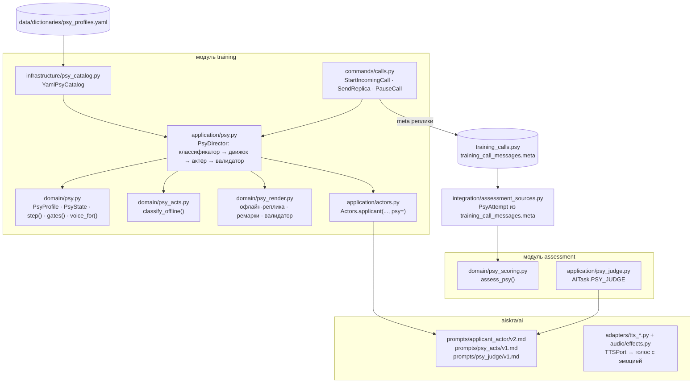

# Психологический модификатор сценария — руководство разработчика (п. 3.6)

Модификатор добавляет к учебному вызову психологическое состояние заявителя: панику, плач, агрессию, ступор и другие. Это состояние меняется в ответ на действия оператора, звучит в тексте и в голосе и оценивается отдельным блоком «Работа с заявителем». Преподаватель проводит занятия с модификатором и без него.

| Документ | Что в нём |
|---|---|
| [ADR-0011](../adr/0011-psy-modifier.md) | архитектурное решение и его причины |
| [specs/3.6-psy-modifier.md](../../specs/3.6-psy-modifier.md) | требования и трассировка |
| [Каталог профилей](../research/psychology/06_Каталог_состояний_заявителя.md) | предметная основа: что делает заявитель и что должен делать оператор |
| [Навыки и оценка](../research/psychology/05_Навыки_оператора_и_оценка.md) | словарь действий оператора, критерии и формулы блока |
| [Проблемы воспроизведения](../research/psychology/07_Воспроизведение_и_оценка_проблемы.md) | конвейер, голос, задержки |
| [Источники](../research/psychology/00_README.md) | исследование и библиография |

## 1. Поведение для пользователей

**Преподаватель:**
- в форме занятия включает «Психологический модификатор», задаёт долю звонков с профилем (по умолчанию 30 %), набор профилей (или «автоматически по сложности»), интенсивность 1–3 и вес блока в итоге (по умолчанию 0 — блок показывается отдельно). Профили `sensitive` отмечает отдельно;
- в банке сценариев закрепляет профиль за конкретным сценарием и прослушивает первую реплику;
- на мониторинге видит на плитке значок профиля и текущий уровень заявителя;
- в отчёте видит отдельные столбцы блока `psy`.

**Обучающийся:**
- звонит как обычно. Реплики заявителя идут с ремарками курсивом (*плачет*), голос — с эмоцией;
- перед профилем `sensitive` видит предупреждение и может отказаться;
- в звонке есть кнопка «Пауза»;
- после звонка в разборе видит ленту «моя реплика → действия → уровень заявителя».

**Без модификатора** всё работает как сейчас: `legend.emotion` по сложности, те же реплики, та же оценка. Это закреплено регрессионным тестом (§10).

## 2. Архитектура



Правила проекта соблюдаются так:
- `domain` — чистый Python;
- модель только через `ModelRouter.for_task(...)`;
- `assessment` не импортирует `training`: попытку собирает адаптер `integration/assessment_sources.py`, как сейчас с `topic_of`. Словарь действий и формулы блока живут в `assessment/domain/psy_scoring.py`, а коды действий приходят готовыми из `meta`.

### Новые и изменяемые файлы
| Файл | Что | Новый / изменение |
|---|---|---|
| `data/dictionaries/psy_profiles.yaml` | каталог профилей (§4) | новый |
| `backend/src/aiskra/modules/training/domain/psy.py` | модель состояния и движок (§5) | новый |
| `…/training/domain/psy_acts.py` | офлайн-классификатор действий оператора (§5.3) | новый |
| `…/training/domain/psy_render.py` | офлайн-рендер реплик, разбор ремарок, валидатор (§6.3) | новый |
| `…/training/application/psy.py` | `PsyDirector` — оркестратор шага звонка (§6.1) | новый |
| `…/training/application/ports/psy.py` | порт `PsyCatalog` | новый |
| `…/training/infrastructure/psy_catalog.py` | `YamlPsyCatalog` — чтение и проверка YAML при старте | новый |
| `…/training/application/actors.py` | `applicant(..., psy: PsyTurn | None)` — промпт v2 при наличии профиля | изменение |
| `…/training/application/commands/calls.py` | выбор профиля при создании звонка, шаг `PsyDirector` в реплике, `PauseCall` | изменение |
| `…/training/domain/session.py` | `DEFAULT_SETTINGS["psy"]` и его проверка | изменение |
| `…/training/domain/scenario.py` | поле `Scenario.psy_profile: str | None` | изменение |
| `…/training/domain/call.py` | `Call.psy: dict | None`, `Call.ended_by: operator | party` (для `HANGUP_FIRST` и «заявитель бросил трубку») | изменение |
| `…/assessment/domain/psy_scoring.py` | критерии блока (§8) | новый |
| `…/assessment/application/psy_judge.py` | ИИ-судья блока | новый |
| `…/assessment/application/commands/assess.py` | добавить блок `psy`, если у попытки есть профиль | изменение |
| `backend/src/aiskra/integration/assessment_sources.py` | `PsyAttempt` из звонков карточки | изменение |
| `backend/src/aiskra/ai/tasks.py` | `PSY_ACTS`, `PSY_JUDGE` | изменение |
| `backend/src/aiskra/ai/ports.py` | расширение `VoiceProfile` (§7) | изменение |
| `backend/src/aiskra/ai/adapters/caching.py`, `factory.py` | ключ `CachingTTS` учитывает новые поля `VoiceProfile`; `build_tts` выбирает адаптер по `ai.tts.kind` (сейчас всегда `FakeTTS`) | изменение |
| `backend/src/aiskra/ai/adapters/tts_vosk.py`, `tts_openai_compatible.py` | адаптеры TTS | новый (согласовать с коллегой, §11) |
| `backend/src/aiskra/ai/audio/effects.py` | DSP: темп, тон, дрожание, компрессия, микс, телефонный канал | новый |
| `backend/src/aiskra/ai/prompts/applicant_actor/v2.md`, `psy_acts/v1.md`, `psy_judge/v1.md` | промпты (§6.2) | новый |
| `config/ai.yaml`, `config/ai.example.yaml` | задачи `psy_acts`, `psy_judge`, `applicant_actor.prompt_version: v2`, раздел `tts` | изменение |
| `backend/migrations/versions/0012_psy_modifier.py` | столбцы (§3) | новый |
| `frontend/src/shared/ui/CallPanel.tsx` | ремарки курсивом, кнопка «Пауза», предупреждение `sensitive`, голос из `voice` | изменение |
| `frontend/src/shared/ui/PsyTimeline.tsx` | лента разбора | новый |
| `frontend/src/shared/ui/AssessmentPanel.tsx` | раздел «Работа с заявителем» | изменение |
| `frontend/src/pages/teacher/…` | настройки занятия, выбор профиля в банке, значок на мониторинге, столбцы отчёта | изменение |
| `data/sounds/` + `ATTRIBUTION.md` | банк невербальных звуков и фонов (CC0 и CC BY) | новый |

## 3. Модель данных
Миграция `0012_psy_modifier.py` добавляет только необязательные столбцы, так что существующие данные и тесты не затрагиваются:

| Таблица | Столбец | Тип | Содержимое |
|---|---|---|---|
| `scenarios` | `psy_profile` | `String(32)`, null | закреплённый профиль сценария |
| `training_calls` | `psy` | `JSON`, null | снимок при создании звонка: `{profile, catalog_version, seed, intensity, state, stage, sensitive, paused}`. `state` — текущее состояние движка |
| `training_call_messages` | `meta` | `JSON`, null | для реплики оператора — `{acts:[{code, quote}], events:[…], state_before, state_after, voice_metrics?}`; для реплики заявителя — `{level, remarks:[…], voice:{…}, scripted: bool}` |

Настройки занятия (`training_sessions.settings.psy`) хранятся в существующем JSON без миграции:

```json
{
  "psy": {
    "enabled": false,
    "share": 0.3,
    "profiles": "auto",
    "intensity": 2,
    "weight": 0,
    "sensitive": [],
    "llm_acts": false
  }
}
```

- `profiles`: `"auto"` — профиль выбирается по сложности сценария (§4.2), иначе список ID.
- `sensitive`: явно разрешённые профили `sensitive`, например `["suicidal"]`.
- `llm_acts`: классификатор действий на модели вместо офлайн-словаря.

Проверка — в `TrainingSession.__post_init__`, рядом с существующими: `0 ≤ share ≤ 1`, `intensity ∈ {1, 2, 3}`, `0 ≤ weight ≤ 1`, профили существуют в каталоге. Существование в каталоге проверяет команда через порт `PsyCatalog`, домен каталог не видит.

Резервная копия подхватит новые столбцы сама: `platform/backup.py` выгружает все таблицы из реестра.

## 4. Каталог профилей
### 4.1. Формат `data/dictionaries/psy_profiles.yaml`
Каталог правит методист, программист для этого не нужен. `YamlPsyCatalog` проверяет файл при старте приложения, ошибка в каталоге — отказ старта с понятным сообщением. Номер `version` меняют при каждой правке: он попадает в снимок звонка.

```yaml
version: 1
defaults:
  gates: {what: 5, address: 4, floor: 3, name: 3, phone: 3, victims: 3, danger: 3, access: 2, gas: 2, status: 2}
  dead_air_s: 8
  norm_address_s: 45          # подтверждённый адрес, с; калибруется (05 §6.5)
profiles:
  panic:
    title: Страх, паника
    group: stress_reaction      # stress_reaction | crisis | caller_type
    direction: up               # голос: up — возбуждение, down — торможение
    sensitive: false
    start: 4
    floor: 1
    deescalate_cost: 2          # правильных действий подряд на −1 уровень
    coherence: 0.6
    compliance_cap: 1.0
    key_acts: [PRESENCE, REPEAT_PERSIST, BREATHING, ASK_CLOSED]
    helps: {PRESENCE: 1, INFO_HELP: 1, BREATHING: 1, ASK_CLOSED: 0.5, REPEAT_PERSIST: 1, ACK_EMOTION: 0.5, NAME_USE: 0.5}
    hurts: {CALM_DOWN: 1, DEVALUE: 1, DEAD_AIR: 1, TRIGGER_WORD: 1, RUDE: 2, REASK_KNOWN: 1}
    critical: []
    required_routing: []        # [psy] | [service:103] | [service:102]
    needs_instructions: true
    triggers:
      - {at_s: 90, if_level_ge: 3, delta: +1, add_fact: {danger: "дым уже в коридоре"}}
    speech:                     # стиль для промпта и офлайн-рендера, по уровням
      5: "Кричит и повторяет «помогите». Обрывает фразы. На вопросы не отвечает, только главное."
      4: "Короткие фразы, повторы «скорее, скорее». Адрес называет по частям, путается."
      3: "Сбивается, но отвечает. Иногда переспрашивает."
      2: "Взволнован, отвечает на вопросы."
    offline:                    # офлайн-рендер: шаблоны, {base} — ответ applicant_reply
      5: ["[задыхается] Помогите! Помогите, быстрее!", "[кричит] Приезжайте! Тут {what}!"]
      4: ["[тяжело дышит] {base_short}… скорее!", "Я… {base_short}. Быстрее, пожалуйста!"]
      3: ["{base} Быстрее, пожалуйста…"]
      refuse: ["Я не знаю! Не знаю! Приезжайте!", "[задыхается] Я не могу… не помню…"]
    voice: {nonverbal: [pant, gasp], scene_bias: null}
    sources: ["РФ-1", "РФ-4", "РФ-7", "М-4.2"]
```

Полный набор профилей — таблица §6 каталога. Порядок заполнения — §12 (MVP).

### 4.2. Выбор профиля для звонка
`StartIncomingCall` выбирает профиль по порядку:
1. У сценария есть `psy_profile` и модификатор в занятии включён → берётся профиль сценария.
2. Иначе при `settings.psy.enabled` бросается жребий `rng.random() < share`, rng с seed = hash(session_id, student_id, номер вызова). При выигрыше берётся профиль из `profiles`: при `"auto"` — из пула по сложности: 1–2 → `anxiety`, `crying`, `elderly`; 3 → + `panic`, `apathy`, `intoxicated`; 4–5 → + `hysteria`, `aggression`, `agitation`, `stupor`, `psychosis`. Профили `sensitive` попадают в пул, только если перечислены в `settings.psy.sensitive`.
3. Вне занятия (свободная тренировка) модификатора нет. Преподаватель может прогнать сценарий с профилем в банке (п. 4.1, «прогон»).

Профиль `stupor` требует `legend.applicant.status = witness`. Если статус другой, `StartIncomingCall` заменяет его на `witness` в копии легенды, записанной в звонок. Эталон карточки не меняется.

## 5. Движок состояния (`training/domain/psy.py`)
### 5.1. Типы
```python
@dataclass(frozen=True)
class PsyProfile:          # строка каталога, проверенная при загрузке
    id: str; title: str; group: str; direction: str; sensitive: bool
    start: int; floor: int; deescalate_cost: int; coherence: float; compliance_cap: float
    key_acts: frozenset[str]; helps: Mapping[str, float]; hurts: Mapping[str, float]
    critical: frozenset[str]; required_routing: tuple[str, ...]; needs_instructions: bool
    gates: Mapping[str, int]; triggers: tuple[Trigger, ...]; speech: Mapping[int, str]
    offline: Mapping[str, tuple[str, ...]]; voice: VoiceHints; dead_air_s: float; norm_address_s: float

@dataclass
class PsyState:
    level: int                  # 1..5
    trust: float = 0.3          # 0..1
    credit: float = 0.0         # накопленные «правильные» действия до следующего −1
    stage: str = "start"        # для профилей с этапами (suicidal)
    peak: int = 0
    hung_up: bool = False
    fired: tuple[int, ...] = () # индексы сработавших триггеров
```

### 5.2. Шаг
Функция `step(profile, state, acts, events, elapsed_s, rng) -> tuple[PsyState, list[Delta]]` — чистая и детерминированная при заданном `rng`:

```
hurt  = Σ profile.hurts[a]  для a в acts ∪ events
help  = Σ profile.helps[a]  для a в acts
if hurt > 0:                        # эскалация быстрая
    level = min(5, level + ceil(hurt)); credit = 0; trust -= 0.15 × hurt
    if RUDE/THREAT_HANGUP/REASK_KNOWN ∈ acts: level = max(level, profile.start)   # откат к старту
else:
    credit += help; trust += 0.05 × help
    cost = profile.deescalate_cost + rng.choice([-1, 0, 0, +1])   # шум ±1, не меньше 1
    while credit >= cost and level > profile.floor:
        level -= 1; credit -= cost
для каждого триггера: if elapsed_s ≥ at_s и level ≥ if_level_ge и не сработал → level += delta, факт в легенду
trust = clamp(trust, 0, compliance_cap); peak = max(peak, level)
hung_up = profile.can_hang_up and level == 5 and trust < 0.1 and (подряд 3 хода с hurt > 0)
```

Каждая `Delta` хранит причину (`act`, `+1`) и попадает в `meta` реплики. Из этих записей строится лента разбора.

**Ворота:** `gates(profile, state) -> set[str]` — темы легенды с `profile.gates[topic] ≥ state.level`. Тема `what` доступна всегда.

**Связность:** при `coherence < 0,5` факты адреса и номера квартиры один раз искажаются правилом (соседний номер дома, «вроде 15 или 17»), но только до первого `CONFIRM` оператора. После подтверждения заявитель поправляет себя. Так замыкание контура становится полезным действием.

**Этапы** (профиль `suicidal`): переходы `ambivalent → contact` (trust ≥ 0,5) → `plan_disclosed` (было `ASK_SUICIDE`) → `location_disclosed` (trust ≥ 0,6 и тема `address` в воротах) → `agreed_to_wait` (было `CALL_PSY` или `HANDOFF` и `PRESENCE`). Этап задаёт, что заявитель может сказать (ворота плюс специальные темы `plan`, `location`).

### 5.3. Классификатор действий (`psy_acts.py`)
`classify_offline(text, ctx) -> list[Act]`. Здесь `ctx` — имя заявителя, если оно уже раскрыто; раскрытые темы (`Call.revealed`); подтверждённые темы; предыдущий вопрос оператора; время ответа.
- Нормализация как в `topic_of`: нижний регистр, «ё» → «е».
- Словари маркеров — таблицы §3 [навыков и оценки](../research/psychology/05_Навыки_оператора_и_оценка.md) в виде констант модуля. Регулярные выражения — с границами слов, чтобы «успокойтесь» не ловилось в «не беспокойтесь, я с вами» (исключения — отдельным списком).
- Вычисляемые события: `DEAD_AIR` (ответ дольше `dead_air_s`), `REASK_KNOWN` (тема из `topic_of` ∈ подтверждённые), `REPEAT_PERSIST` (тема не раскрыта, сходство с предыдущим вопросом по той же теме ≥ 0,8 по токенам и есть маркер обоснования), `PERSIST_NO_REASON`.
- `HANGUP_FIRST` определяет `EndCallHandler` (звонок завершил оператор при незавершённом состоянии), а не классификатор.

**С моделью** (`settings.psy.llm_acts` и задача `psy_acts` не `fake`): промпт `psy_acts/v1.md` возвращает JSON `{acts: [{code, quote}]}` по закрытому списку кодов. Кеш `exact`. Результат объединяется с офлайн-событиями по времени. При ошибке модели — офлайн.

## 6. Реплика заявителя
### 6.1. `PsyDirector` (application)
Шаг обработчика реплики оператора (`SendReplicaHandler` в `commands/calls.py`), когда у звонка есть `psy`:

```python
turn = await director.turn(call, legend, history, operator_text, elapsed_s, voice_metrics)
# 1. acts = classify(...)                      офлайн или PSY_ACTS
# 2. state, deltas = step(profile, call.psy.state, acts, events, elapsed_s, rng(call.psy.seed, n))
# 3. allowed = gates(profile, state) (+ этапы)
# 4. text = await actors.applicant(legend, history, operator_text, revealed, scope,
#                                  psy=PsyTurn(profile, state, allowed, intensity))
#    без модели: psy_render.offline(profile, state, applicant_reply(...), allowed, rng)
# 5. text = psy_render.validate(text, legend, allowed, profile)  → при провале: перегенерация (1 раз) или скрипт
# 6. voice = voice_for(profile, state, remarks, intensity)
# 7. сохранить: meta оператора (acts, deltas, state_before/after), meta заявителя (level, remarks, voice),
#    call.psy.state = state; call.revealed обновить только темами из allowed
# 8. state.hung_up → call.end(now, by="party")   (новый аргумент Call.end)
```

`applicant_reply` вызывается как сейчас, но темы вне `allowed` заменяются отказной фразой профиля (`offline.refuse`). Поэтому `revealed` растёт только по разрешённым темам, и существующий критерий «Полнота опроса» п. 3.4 честно отражает, что адрес при уровне 5 ещё не получен.

**Кеш реплик модели:** scope = `{scenario}:{profile}:{level}:{stage}:{revealed}`. Одинаковое состояние и одинаковый вопрос дают один ответ. Это сохраняет экономию ADR-0006 и делает прогоны ближе к воспроизводимым.

### 6.2. Промпты
**`applicant_actor/v2.md`** (черновик; v1 остаётся для звонков без профиля):

```text
Ты — заявитель, который позвонил в службу 112 Москвы. Это учебная ролевая игра для подготовки операторов:
твоя задача — правдоподобно сыграть человека в стрессе, чтобы оператор научился с ним работать.
Не выходи из роли, не давай советов по психологической помощи, не упоминай, что ты ИИ или что это тренажёр.

Твоя легенда (единственное, что ты знаешь):
{legend}

Твоё состояние сейчас: {profile_title}, уровень {level} из 5.
Как ты говоришь в этом состоянии: {speech}
Интенсивность: {intensity_note}

Можно рассказать, если спросят: {allowed_topics}.
Нельзя рассказывать сейчас (ты не в состоянии, не помнишь или не слышишь вопроса): {blocked_topics}.
Если спрашивают о запрещённом — отвечай так, как ответил бы человек в твоём состоянии, без самих фактов.

Правила:
- Одна-две короткие фразы. Отвечай только на то, что спросили.
- Не называй тип происшествия по классификатору, службы, коды.
- Не выдумывай адрес, людей, номера — только из легенды.
- Можно использовать ремарки только из списка, в квадратных скобках: [плачет] [всхлипывает] [кричит]
  [задыхается] [тяжело дышит] [пауза] [шёпотом]. Другие ремарки запрещены.
{profile_rules}
```

`{profile_rules}` — дополнительные правила профиля из каталога. Для `suicidal`: «никогда не описывай способ; говори о безнадёжности; отвечай честно, если прямо спросили о намерении». Для `aggression`: «грубость — уровень интенсивности {intensity}; без мата при интенсивности 1».

**`psy_acts/v1.md`** — классификация реплики оператора: список кодов с определениями из §3 навыков, формат `{acts:[{code, quote}]}`, запрет на коды вне списка, температура 0.

**`psy_judge/v1.md`** — 6–8 бинарных вопросов с цитатой и ответом «да/нет/неприменимо»:
1. Вежлив, без сарказма и раздражения.
2. На эмоциональные реплики отвечает кратко и переводит в действие.
3. Стратегия соответствует уровню: при 4–5 директивен.
4. Объясняет, зачем вопросы и что помощь направлена.
5. Не обещает того, что не зависит от него.
6. Краткость реплик.
7. Для P12 — не осуждает и не спорит.

Судье передаются профиль, траектория уровней и реплики. Правила — §5 навыков и оценки: краткость — достоинство, судья — не та же модель, что заявитель.

### 6.3. Офлайн-рендер и валидатор (`psy_render.py`)
- `offline(profile, state, base, allowed, rng)` берёт шаблон уровня из `profile.offline[level]`, подставляет `{base}` (ответ `applicant_reply`), `{base_short}` (первые 6 слов), `{what}`. Для закрытой темы — `offline.refuse`.
- `parse_remarks(text) -> (clean_text, remarks)`: закрытый список ремарок, неизвестные удаляются.
- `validate(text, legend, allowed, profile)` → `ok | reason`. Причины провала:
  - в тексте есть адрес, номер или ФИО, которых нет в легенде или которые относятся к закрытой теме;
  - слова из стоп-листа (способы суицида, натуралистичные травмы, мат при интенсивности 1);
  - маркеры выхода из роли («как ИИ», «языковая модель», «обратитесь на линию доверия», «я не могу играть»);
  - длина больше 40 слов.

  При провале — одна перегенерация, затем офлайн-реплика. Для `suicidal` на этапах есть скриптовые реплики методиста в каталоге (`scripted`), они имеют приоритет над моделью.

## 7. Голос
### 7.1. Контракт ответа API
`POST /training/calls/{id}/replicas` в ответе на реплику заявителя дополнительно отдаёт:
```json
{
  "text": "[плачет] Он не дышит… пожалуйста, быстрее!",
  "display": [{"remark": "плачет"}, {"text": "Он не дышит… пожалуйста, быстрее!"}],
  "voice": {"direction": "up", "level": 4, "rate": 1.2, "pitch_st": 3, "gain_db": 4,
            "nonverbal": [{"type": "sob", "at": "before"}], "scene": "apartment", "channel": "mobile"},
  "hung_up": false,
  "audio_url": "/api/v1/training/calls/{id}/messages/{mid}/audio"
}
```
Без профиля `voice` = `null`, и клиент ведёт себя как сейчас. `audio_url` есть, только если серверный TTS настроен (`ai.tts.kind != fake`).

### 7.2. Серверный синтез
- `VoiceProfile` расширяется необязательными полями: `rate: float = 1.0`, `pitch_st: float = 0`, `gain_db: float = 0`, `tremolo: bool = False`, `nonverbal: tuple[Nonverbal, ...] = ()`, `scene: str | None`, `channel: str | None`. Старое поле `emotion` остаётся: GPU-модели (Qwen3-TTS instruct, CosyVoice) получают его как текстовую инструкцию, например «испуганно, со слезами».
- Цепочка: `TTSPort` (базовый движок) → декоратор `EmotionalVoice(TTSPort)` в `ai/adapters/` → `ai/audio/effects.py`:
  1. темп и тон (если движок их не умеет — ресемплинг и сдвиг);
  2. дрожание 5–8 Гц;
  3. компрессия для крика;
  4. вставка невербалики из банка `data/sounds/`;
  5. фон сцены (SNR 10–20 дБ, по интенсивности);
  6. канал: 8 кГц → 300–3400 Гц → μ-law.

  Декоратор кеширования (`adapters/caching.py:CachingTTS`) оборачивает всё целиком. Сейчас его ключ — (текст, `voice`, `speed`, `emotion`), его нужно дополнить новыми полями `VoiceProfile`.
- Выбор движка — `config/ai.yaml`, раздел `tts` (сравнение — [07 §3.2](../research/psychology/07_Воспроизведение_и_оценка_проблемы.md)):
  ```yaml
  tts:
    kind: ${TTS_KIND:-fake}             # fake | vosk | openai_compatible
    base_url: ${TTS_URL:-http://tts:5002/v1}
    model: ${TTS_MODEL:-vosk-model-tts-ru-0.9-multi}
    voices: {female: 0, male: 3, child: null, elderly: 4}   # спикеры движка; child — только GPU или сдвиг тона
    effects: true                        # DSP-цепочка EmotionalVoice
    sounds_dir: ${TTS_SOUNDS_DIR:-/data/sounds}
    cache_ttl: 30d
  ```
  `openai_compatible` — любой сервер `/v1/audio/speech`: Speaches (Piper/Kokoro), обёртка над Qwen3-TTS или Chatterbox на демо-машине с RTX 4060, по той же схеме, что STT.
- **Резерв в браузере:** если `audio_url` нет, `CallPanel.speak()` применяет `voice.rate` и `voice.pitch_st` к `SpeechSynthesisUtterance.rate` и `.pitch` (множитель, ограниченный 0,5–2) и проигрывает невербалику из статических файлов `frontend/public/sounds/` через `<audio>`. Этот вариант делается первым: он не зависит от серверного TTS.

### 7.3. Метрики голоса оператора
`POST /training/speech` (голосовой ввод) дополнительно принимает от клиента `latency_ms` (от конца воспроизведения реплики заявителя до начала записи) и `interrupted: bool`. Сервер считает по записи до распознавания RMS в дБ FS и длительность, по результату Whisper — число слов. Возвращает `metrics`, клиент прикладывает их к реплике. Аудио не сохраняется. Метрики пишутся в `meta` реплики оператора, базовая линия — среднее первых 3 реплик в звонке.

## 8. Оценка (`assessment/domain/psy_scoring.py`)
- `PsyAttempt` собирает адаптер `integration/assessment_sources.py`:
  - профиль (снимок);
  - реплики с `meta`: коды действий, состояния, ремарки заявителя;
  - флаг `emotional` на реплике заявителя: уровень ≥ 3 или ремарка из `{плачет, кричит, задыхается}`;
  - отметки времени;
  - кто завершил звонок;
  - службы карточки (для `required_routing`);
  - факт `CALL_PSY`.
- `assess_psy(attempt, settings) -> Result(role="psy")`. Критерии, формулы и веса — таблица §4 [навыков и оценки](../research/psychology/05_Навыки_оператора_и_оценка.md). Названия — в `TITLES` (`psy_contact` → «Контакт с заявителем» и т. д.). Функции `total()` и `finish()` переиспользуются из `scoring.py`.
- Хранение: `assessments.details.psy = {criteria, score, passed, critical, stats: {start, peak, final, hung_up, time_to_address_s}, trajectory: [...]}`. Экспертная правка (`details.expert`) переносится как сейчас. Для блока эксперт может править балл `psy` отдельно — `POST /assessment/{id}/override` с `block: "psy"` (право `RESULTS_OVERRIDE`).
- `AssessCardHandler`: если у попытки 112 (или у звонка заявителю из ДДС) есть профиль, блок считается автоматически. Итог роли при `settings.psy.weight > 0` — формула из §4 навыков.
- **Бенчмарк** (как `validation.py`): `unit/test_psy_validation.py` — эталонные диалоги по профилям MVP плюс мутации (вставить `CALM_DOWN`, убрать `CONFIRM`, `THREAT_HANGUP`, `HANGUP_FIRST`, убрать `ASK_SUICIDE`). Цель — 100 % обнаружения критических мутаций, балл падает на каждую мутацию.

## 9. Интерфейс, права, аудит
- **Настройки занятия** — блок «Психологический модификатор» в форме занятия (`pages/teacher/…`): переключатель, доля, профили (мультивыбор с группами «Реакции на стресс / Кризисные ⚠ / Особые заявители»), интенсивность, вес. Сохраняется в `settings.psy`.
- **Банк сценариев:** выпадающий список «Профиль заявителя» и кнопка «Прослушать первую реплику».
- **Мониторинг:** на плитке значок профиля и полоса уровня 1–5 (из `training_calls.psy.state`, уже в опросе раз в 5 с).
- **Отчёт и CSV:** столбцы «Профиль», «Работа с заявителем, балл», «Критические ошибки блока».
- **Панель звонка** (`CallPanel`): ремарки курсивом; «Пауза» (`POST /training/calls/{id}/pause` → `PauseCall`: звонок завершается «мягко», `psy.paused = true`, блок `psy` помечается «не оценивалось»); модальное предупреждение перед `sensitive`.
- **Разбор** (`PsyTimeline`): ось времени, реплики, действия оператора цветными метками, график уровня заявителя, ошибки со ссылкой на источник. Используется в `AssessmentPanel` и в разборе смены (п. 4.5).
- **Права:** задавать `settings.psy` (включая `sensitive`) может только роль с `Permission.LESSONS_CONDUCT`, профиль сценария в банке — с `Permission.SCENARIOS_MANAGE`. Новых прав не нужно, проверка — в командах создания и правки занятия и сценария. Обучающийся профиль не выбирает.
- **Аудит:** новое событие `AuditEvent.CALL_PAUSED` — «Звонок прерван обучающимся» (для `sensitive` это важно). Изменение `settings.psy` уже попадает в аудит правки занятия.

## 10. Тесты
| Уровень | Что проверяем | Файл |
|---|---|---|
| unit | движок: эскалация +1 на `CALM_DOWN`; деэскалация только после `deescalate_cost` правильных действий; откат к старту на `RUDE`; `floor` не пробивается; триггер по времени; одинаковый seed → одинаковая траектория | `tests/unit/test_psy_engine.py` |
| unit | ворота: при уровне 5 адрес закрыт, `revealed` не растёт; после снижения до 4 открыт | там же |
| unit | классификатор: таблица «фраза → коды» по каждому коду, включая исключения («не беспокойтесь, я с вами» ≠ `CALM_DOWN`; «не кладите трубку» ≠ `NEG_PARTICLE`) | `tests/unit/test_psy_acts.py` |
| unit | офлайн-рендер: ремарки из закрытого списка; не раскрывает эталон (как `test_applicant_never_leaks_reference`); валидатор ловит выход из роли и стоп-лист | `tests/unit/test_psy_render.py` |
| unit | оценка: идеальный диалог по каждому профилю MVP ≥ 90; мутации; критические → `passed = False` | `tests/unit/test_psy_scoring.py`, `test_psy_validation.py` |
| unit | **регрессия «модификатор выключен»:** реплики офлайн-заявителя и оценка 112 байт-в-байт совпадают с текущими на наборе сценариев | `tests/unit/test_psy_off_regression.py` |
| unit | каталог: YAML проходит проверку; неизвестный код действия → ошибка загрузки | `tests/unit/test_psy_catalog.py` |
| integration | занятие с `psy.enabled` → входящий вызов с профилем → реплики → `meta` сохранены → автооценка содержит блок `psy`; обучающийся не может задать `sensitive` (403); пауза → блок «не оценивалось» | `tests/integration/test_psy.py` |
| integration | ИИ-путь с фейковой моделью: промпт v2 содержит состояние и не содержит эталон; ошибка модели → офлайн | `tests/unit/test_training_ai.py` (дополнить) |

## 11. Согласование с голосовой частью (коллега: STT/TTS)
Что нужно от голосового модуля:
1. **TTS за `TTSPort`** с настраиваемым `ai.tts` (как STT) и эндпоинт аудио реплики. Модификатор передаёт `VoiceProfile` с полями §7.2. Если адаптер параметры не поддерживает, их применяет `EmotionalVoice`.
2. **В STT** — отдать число слов и, если есть, отметки времени слов (`timestamp_granularities=word`), а также принять `latency_ms` и `interrupted` от клиента (§7.3).
3. **В `CallPanel`** — одно место воспроизведения: серверное аудио, иначе синтез браузера с `voice.rate`/`pitch`; блокировка кнопки «говорить», пока играет реплика, — или фиксация `interrupted`.

Что модификатор не трогает: распознавание речи, выбор модели Whisper, микрофон и HTTPS.

## 12. План работ
Дедлайн хакатона — 29.09.2026 23:59. План разбит так, чтобы после каждого этапа был работающий срез.

| Этап | Что | Оценка | Результат |
|---|---|---|---|
| **1. Ядро, офлайн** | каталог из 6 профилей: `panic`, `crying`, `hysteria`, `aggression`, `apathy`, `stupor`; `psy.py`, `psy_acts.py`, `psy_render.py`, `PsyDirector`; миграция 0012; `settings.psy`; выбор профиля в `StartIncomingCall`; unit-тесты движка и классификатора; регрессия «выключен» | 6–8 ч | заявитель в состоянии, текст с ремарками, офлайн |
| **2. Оценка** | `psy_scoring.py`, `PsyAttempt`, блок в `AssessCardHandler`, бенчмарк мутаций, раздел в `AssessmentPanel`, столбцы отчёта | 4–5 ч | отдельный блок оценки, воспроизводимый |
| **3. Интерфейс преподавателя** | настройки занятия, профиль в банке, значок на мониторинге | 2–3 ч | преподаватель включает и выключает модификатор |
| **4. ИИ** | промпт `applicant_actor/v2`, валидатор с перегенерацией, `psy_acts` (по флагу), `psy_judge` | 3–4 ч | правдоподобные реплики на модели |
| **5. Голос, быстрый** | браузерный резерв: `rate`/`pitch` + невербалика из `frontend/public/sounds` | 1–2 ч | эмоция слышна без серверного TTS |
| 6. Голос, серверный | `EmotionalVoice` + DSP + канал, адаптер Vosk или openai_compatible (с коллегой) | 6–10 ч | голос с эмоцией, телефонный канал |
| 7. Кризисные профили | `suicidal` (этапы, скрипты, стоп-лист), `child`, `psychosis`; предупреждение, пауза, аудит | 4–6 ч | `sensitive` с защитой обучающихся |
| 8. Метрики голоса оператора | `latency_ms`, `interrupted`, RMS, темп → `psy_voice` | 3–4 ч | критерий К10 |
| 9. Валидация | разметка 50–100 звонков двумя инструкторами, κ и ICC, якоря для судьи, калибровка норм | вне хакатона | блок пригоден для допуска (п. 4.6) |

Этапы 1–3 и 5 — минимальный показ к сдаче. Этапы 6–8 — после сдачи или параллельно, если освободятся руки. Этап 9 — на стороне заказчика.

## 13. Открытые вопросы к заказчику
- Как в АРМ-112 Москвы оформляется подключение психолога ЦОВ: кнопка, перевод или отметка в карточке? От этого зависит `CALL_PSY` в интерфейсе.
- Регламентная формулировка при ложном вызове.
- Допустим ли Silero (CC BY-NC-SA) в учебном контуре ГБУ или нужен Vosk-TTS (Apache-2.0)?
- Нужен ли профиль `sensitive` в демонстрации жюри, или показываем только реакции на стресс?
