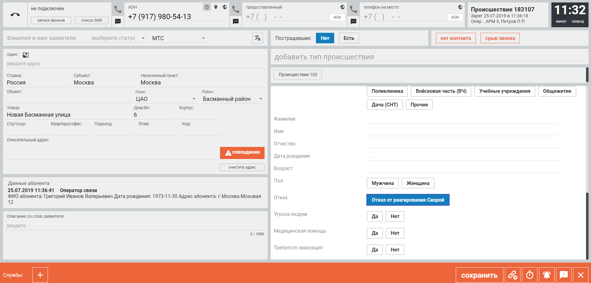

# Карточка происшествия 112 и бизнес-процесс оператора

Источник: «Инструкция по заведению карточки происшествия» (модуль «Приём и обработка вызовов 112», Департамент ГОЧСиПБ г. Москвы, версия 2507ГСИ; в тексте упоминаются релизы 1.7 / 1.8 / 2.0 / 2.1). Заказчик назвал этот документ «Памяткой „Работа на АРМ-112“» и указал его как первичный источник данных для тренажёра (ТЗ) и как описание процесса «что к чему» (#624).

Скриншоты из документа лежат в `data/source/screenshots/instr/imageNN.png`. Нумерация файлов не совпадает с номерами рисунков в документе, поэтому везде указано имя файла. Реальная система: веб-АРМ в Chrome, телефония Avaya, карты Яндекс, адреса ФИАС.

Для тренажёра это — эталон интерфейса роли «Оператор 112» (карточка должна быть 100% похожа, #680) и источник правил для эталонов и автооценки.

---

## 1. Компоновка экрана карточки

Полноэкранные примеры карточки в режиме создания:  `image18.png` (тип 103), `image37.png` (тип 104), `image46.png` (тип 101).

| Зона | Содержимое |
|---|---|
| Верхняя полоса (шапка) | статус телефонии, кнопки «записи звонков» / «список SMS», три телефона (АОН, предоставленный, на место), канал связи, заголовок «Происшествие NNNNNN / Зарег. дата время / Опер. NNNN, АРМ NNN, ФИО», таймер мм:сс |
| Вторая полоса | слева: ФИО заявителя, статус заявителя, иностранный язык; справа: «Пострадавшие: Нет / Есть, Количество», кнопки «нет контакта», «срыв звонка» |
| Левая колонка | блок «Адрес» (единая строка + поля), блок «Данные абонента» (по запросу), блок «Описание со слов заявителя» |
| Правая колонка | строка «что случилось?» / «добавить тип происшествия», плашки частых типов, значимые типы, чипы выбранных типов, опросные карты по каждому типу |
| Нижняя оранжевая полоса | «Службы:» — чипы назначенных служб + «+», кнопка «сохранить», иконки: связь, напоминание, «важное происшествие» (колокол), «сообщить о проблеме», «×» |

Документ называет 4 обязательных блока: телефоны заявителя, «что случилось», адрес, подробности происшествия. Дополнительно обязательно: «Описание со слов заявителя», «ФИО заявителя», «Статус заявителя», группа «Пострадавшие». Блоки заполняются в любом порядке.

## 2. Поля карточки

### 2.1. Шапка и телефоны (`image4–image8.png`, `image10.png`, `image96.png`, `image111.png`)

| Поле | Тип | Заполнение | Примечание |
|---|---|---|---|
| Статус телефонии | индикатор: не подключен / доступен / недоступен / ошибка | авто | при открытой карточке — «недоступен», снимается через 10 с после закрытия |
| Телефон АОН (Alt+F1) | телефон +7 (___) ___-__-__ | авто из телефонии, не редактируется | может быть «Без SIM карты»; иконки: «?» запрос данных абонента, геометка, глобус «зарубежный номер»; трубка — исходящий звонок, SMS — отправить СМС |
| Предоставленный номер (Alt+F2) | телефон | со слов заявителя | кнопка «АОН» копирует номер |
| Телефон на место (Alt+F3) | телефон | со слов заявителя | кнопка «АОН» копирует |
| Зарубежный номер | флаг у каждого телефона | оператор | обязателен, если номер не с +7 |
| Канал связи (Alt+K) | справочник с поиском | авто для Теле2, МТС, Мегафон, Билайн; иначе вручную | значения: ЕССМ, Линия ДСП, МГТС-112, Мегафон, Мобильное приложение, МТС, МЧС, … (`image8.png`) |
| Заголовок карточки | read-only | авто | номер, дата регистрации, оператор/АРМ или внешняя система («Служба смс», ВИС) |
| Таймер | мм:сс | авто: старт при открытии, стоп по «Сохранить» | время обработки уходит в отчёты — основа для оценки тайминга |

### 2.2. Заявитель (Alt+Q) (`image9.png`, `image40.png`, `image41.png`, `image43.png`)

| Поле | Тип | Обяз. | Значения / правила |
|---|---|---|---|
| ФИО заявителя | текст | да | авто-капитализация первой буквы |
| Статус заявителя | справочник | да | **очевидец, пострадавший, родственник, знакомый, ребенок, участник** |
| Вызов на иностранном языке | тумблер | нет | есть также тип происшествия «Вызов на иностранном языке» |

После сохранения ФИО и статус заявителя **изменить нельзя**.

### 2.3. Пострадавшие (Alt+P) (`image44.png`)

| Поле | Тип | Правила |
|---|---|---|
| Пострадавшие | переключатель Нет / Есть | обязательно; по умолчанию «Нет» |
| Количество | целое | появляется при «Есть»; можно менять после сохранения |

### 2.4. Нерезультативный вызов (Alt+N) (`image11–image13.png`)

Кнопки «нет контакта» и «срыв звонка»: карточка уходит в статус «Завершена» с признаком «Проверено»; модал «Сохранить карточку как пустую?» с вариантами «вернуться и заполнить» / «сохранить карточку как пустую». В журнале — `<Нет контакта>` / `<Срыв связи>`.

### 2.5. Что случилось? Типы происшествий (Alt+T, значимые Alt+R) (`image16.png`, `image17.png`, `image23.png`, `image35.png`)

| Элемент | Описание |
|---|---|
| Поисковая строка «что случилось?» → «добавить тип происшествия» | поиск по подстроке, слова в любом порядке, синонимы (101 ↔ пожар, «вызов 03», «запах газа», «авария» и т.п.); уникальное полное название выбирается автоматически |
| Плашки частых типов | множественный выбор; примеры набора: 103, 102, ДТП, Дополнительный звонок от заявителя, Консультация, Ошибочно набран номер, Справка-102, Человек в опасности, Справка-ГИБДД, Справка-103 (`image16.png`); Взрыв, ДТП, 101, Человек в опасности, Аварии и происшествия в городском хозяйстве, Прочие происшествия, 103, 102, Тестовый вызов, 104 (`image23.png`) |
| Значимые типы происшествий | список ссылок, утверждается руководством 112 |
| Выбранный тип | синий чип «Происшествие 101»; отмена — повторный клик или «×» в заголовке опросной карты |
| Отказ от реагирования | кнопка внутри опросной карты 103 («Отказ от реагирования Скорой») |

Всего в системе около 50 типов Единого классификатора происшествий (ЕКП), согласованного со службами. Можно выбрать несколько. В сохранённой карточке: «П: Взрыв Жилое здание», «Класс.: пожар: мусор;», сводка ответов «Улица. Открытое пламя (улица). мусор.» (`image59.png`, `image87.png`). Связь с классификатором происшествий заказчика: тип ЕКП = col12 классификатора, «Класс.:» = итоговый тип col11, ответы опросной карты = признаки col7–col10.

### 2.6. Адрес (Alt+A) (`image19.png`, `image20.png`, `image22.png`, `image29.png`, `image61.png`)

| Поле | Тип | Заполнение | Примечание |
|---|---|---|---|
| Единая адресная строка | автодополнение | ручной ввод → выбор из подсказок | источники: Яндекс.Карты, Яндекс.Организации, ФИАС (источник виден в списке); **дом вводить в этой же строке**; приоритет — Яндекс |
| Страна / Субъект / Населённый пункт | текст | авто | «Россия», «Москва» |
| Объект | текст | ручное | название объекта |
| Округ | справочник | авто по адресу | ВАО, ЗАО, ЗелАО, ЦАО, СЗАО, СВАО, ЮАО, ЮЗАО, ЮВАО, ТиНАО, САО, МО (`image23.png`) |
| Район | справочник | авто | например «Басманный район» |
| Улица, Дом/Вл, Корпус, Стр/соор | текст | авто из строки | |
| Квартира/офис, Подъезд, Этаж, Код | текст | ручное | |
| Описательный адрес | многострочный | ручное + авто | соцобъект в 50 м подставляется автоматически |
| Координаты | широта/долгота в окне карты | «Указать на карте» или ввод + «ОК» | обратное геокодирование заполняет поля (`image27.png`, `image28.png`) |
| Кнопка «очистить адрес» | | | сброс всех полей |
| Кнопка «совпадение» (оранжевая «!») | | авто | недавняя карточка с тем же адресом/телефоном |

Окно карты открывается автоматически после выбора адреса (радиус 50 м), слои Камеры / Техника / Объекты (`image21.png`, `image30.png`, `image54.png`). Координаты от внешних систем: точка, круг, полигон, пиктограмма человека (`image31–image33.png`). При выборе ФИАС-адреса службы автоматически не добавляются. В сохранённой карточке адрес схлопывается в строку: «Россия, Москва, (СЗАО, Строгино), 2-я Лыковская улица, 53, с. 1».

### 2.7. Данные абонента (`image18.png`)

По кнопке «?» у АОН: дата/время запроса, оператор связи, ФИО абонента, дата рождения, адрес абонента. Read-only.

### 2.8. Описание со слов заявителя (Alt+O) (`image38.png`, `image39.png`)

Многострочный текст, счётчик «N / 1999». **В службу 03 (скорая) передаются только первые 100 символов.** Для СМС-карточек заполняется текстом СМС. Можно дополнять после сохранения.

### 2.9. Опросные карты (Alt+n — к n-й карте, Alt+Ctrl+n — к вопросу) (`image34.png`, `image35.png`, `image37.png`, `image46.png`, `image18.png`)

Появляются при выборе типа. Тёмный заголовок с названием типа (подчёркивание сплошное — есть вики-справка, пунктир — нет), «×» удаляет тип. Вопросы — кнопки-чипы (одиночный/множественный выбор), Да/Нет, текст. Ответы могут автоматически добавлять службы.

**Опросная карта «Происшествие 101» (пожар)** (`image35.png`, `image46.png`):
- Где: Улица / Транспорт / Дом / Здание/объект / Опасный объект
- Признак пожара (улица): Дым / Открытое пламя / Запах гари
- Доступ: Нет доступа
- Улица (пламя): мусор / трава / пух / парк / лес / торф / мачта освещения / опора контактной сети / ЛЭП / провода / дерево, деревья
- Место происшествия: Тоннель / Пешеходный переход
- Проведена ли газификация: Да / Нет / Нет данных
- Есть ли перекрытие движения: Да / Нет
- Правонарушение: Есть правонарушение
- Пострадавший: Пострадавший не на месте / Отказ от Скорой
- Угроза людям: Да / Нет; Медицинская помощь: Да / Нет; Требуется эвакуация: Да / Нет
- Описание: текст; Объект связи: Да / Нет

**Опросная карта «Происшествие 104» (газ)** (`image34.png`, `image37.png`):
- Где ощущается запах: Вне помещения (на улице) / В помещении (в квартире, в доме)
- Где (от чего) ощущается запах? (при «Вне помещения»): На улице / В подземном переходе / В коллекторе / В метро (тоннеле) / От колодца, из люка / У водоема / Прочее
- Признаки: Нарушение в работе газового оборудования / Повреждение газопровода / Повышенное давление газа
- Пострадавший: Пострадавший не на месте / Отказ от Скорой

**Опросная карта «Происшествие 103» (скорая)** (`image18.png`, `image49.png`):
- Место: Поликлиника / Войсковая часть / Учебные учреждения / Общежитие / Дача (СНТ) / Прочие / Больница / Вокзал / Квартира / Метро / Образовательные учреждения / Общ. место / Консультация / Медицинские учреждения / Раб. место / Улица
- Фамилия, Имя, Отчество; Дата рождения; Возраст; Пол: Мужчина / Женщина
- Отказ от реагирования Скорой
- Угроза людям, Медицинская помощь, Требуется эвакуация: Да / Нет

Эти три карты соответствуют колонкам классификатора: МЧС (признаки НД, УЛ, ПП), МОСГАЗ (газификация), СМП (пострадавшие / не на месте). Остальные опросные карты восстанавливаются по дереву признаков классификатора (col7–col10).

### 2.10. Службы (Alt+Z) (`image47–image50.png`, `image52.png`, `image56.png`)

- Нижняя панель «Службы:» — чипы с иконкой трубки (перевод вызова), названием и «×». **Основная служба подчёркнута двойной линией.**
- Формируется **автоматически** по типу + адресу (классификатор + территориальная привязка: «Преф. ЦАО», «Упр. Басманного района», «ЖКХ», «ЦОДД») и дополняется ответами опросной карты.
- «+» открывает модал «Добавьте службы» (`image49.png`, `image50.png`): поиск, список (МЧС, МВД, ФСБ, ЦЭМП, Скорая, Мосгаз, …), выбранные — синие, «Сохранить и закрыть».
- Метка «ВИС» — служба добавлена внешней системой (`image52.png`).
- После сохранения чип показывает время и статус: «17:55 Добавлена» → «Получена службой» → «Принята» → … → «Завершение работ»; стрелка открывает историю статусов (`image84.png`, `image87.png`).

### 2.11. Отработки (режим просмотра, Alt+O) (`image70.png`, `image87–image91.png`)

Таблица под карточкой: Опер., АРМ, Дата и время (начало/конец), Служба (справочник: Служба 101, Служба 103, Служба 103 — оперативный отдел / справка / врачи-консультанты / дежурный врач-педиатр / акушерский профиль…), Куда звонили (текст), Телефон (авто по службе), кнопка-трубка (исходящий вызов), ФИО / кто принял, Суть сообщения, галочка «сохранить». Пример (`image70.png`): «МосГаз / дежурный / +7 (495) 222-23-23 / Вертинская Н.Н / отправка экипажа», «МПСС / дежурный / ДЧ отправляет 2АЦ и лестницу».

### 2.12. Служебные признаки и статусы (`image59.png`, `image87.png`, `image92.png`, `image94.png`, `image106.png`, `image114.png`)

- Тумблеры «ЧС» (молния) и «ЧП» (треугольник, активный — оранжевый); на другом стенде «ВП» / «ОП».
- Кнопки «просмотр» / «дополнение» (карандаш): при дополнении доступны только пустые поля, описание и признак пострадавших; блокировка при одновременном редактировании («В данный момент карточка заполняется пользователем: Оп. 1000 Петров П П; АРМ 886»).
- «Создана вручную» (Insert), «Проверена» (колонка-галочка в журнале), источник (СМС, КИС, ВИС).
- **Статусы карточки:** Зарегистрирована → Отработана → Проверена; Завершена (для «нет контакта»/«срыв звонка» сразу с «Проверено»); ошибочные: **Не оповещено** (красный в журнале), **Не завершено** (48 ч нет «Завершение работ» от службы), **Отказ**; служебный «Постобработка вызова». Все переходы фиксируются в Аудите.
- Действия: «Отработана / Завершить» (Alt+S), «Проверена» (Alt+Y, главный специалист), «Вернуть на доработку» (Alt+N).

---

## 3. Бизнес-процесс оператора 112 (пошагово)

1. **Авторизация** (`image1.png`): логин, пароль, номер АРМ; автовыход через 24 ч; проверка статуса телефонии «доступен» (`image2.png`).
2. **Входящий вызов** (`image4.png`): модал «Входящий звонок с номера …», кнопка «Принять». Система автоматически открывает новую карточку, АОН и канал связи заполнены, стартует таймер, статус оператора → «недоступен». Другие входы: СМС (`image112.png` — карточка с текстом СМС и полигоном местоположения), внешняя система (ВИС), ручное создание (Insert). При совпадении номера — бордовый баннер «Есть карточка с заявителем по этому номеру» с кнопками «привязать» / «закрыть и продолжить» (`image62.png`).
3. **Нерезультативный вызов** → «нет контакта» / «срыв звонка» → «сохранить как пустую» → Завершена/Проверено. Конец ветки.
4. **Телефоны**: предоставленный номер, телефон на место, флаг «зарубежный», канал связи.
5. **Что случилось**: выбор типа(ов) плашкой / значимым типом / поиском → открывается опросная карта.
6. **Адрес**: единая строка с домом → выбор варианта (Яндекс приоритетнее ФИАС) → авто-открытие карты → проверка авто-заполненных полей → ручные квартира/подъезд/этаж/код/объект/описательный адрес. Альтернативы: точка на карте, координаты. Соцобъект в 50 м → в описательный адрес. Кнопка «совпадение» при совпадении адреса.
7. **Подробности**: ответы опросных карт (могут добавить службы), пострадавшие (Нет/Есть + количество), ФИО и статус заявителя, описание со слов заявителя (лимит 100 символов для 03), флаг иностранного языка, запрос данных абонента.
8. **Службы**: проверка автоматического списка; ручное добавление/удаление — только в нештатной ситуации; для ФИАС-адресов — вручную.
9. **Перевод / конференция** (только при активном звонке до сохранения): трубка на чипе службы → модал «Управление звонком» (`image71.png`): «Перевести» (слепой), «Перевести с удержанием» (подтверждение `image72.png`), «Добавить в конференцию» (до 4 участников, `image73.png`); перевод на другого оператора по номеру АРМ.
10. **Сохранение** (Alt+S): модал «Список оповещаемых служб: [Служба 103]» → «оповестить и сохранить карточку» / «вернуться к заполнению» (`image56.png`). Данные уходят в службы, карточка в общем списке, таймер останавливается, экран переходит к отработкам. Нет сети → «сохранить локально» (`image58.png`).
11. **После сохранения**: статусы служб обновляются автоматически; отработки для служб, не оповещённых автоматически, и исходящих звонков; дополнение карточки; связи между карточками (главная/подчинённая, `image65–image68.png`); напоминание («Минуты», «О чем напомнить?», `image99.png`, повтор каждые 20 с, `image100.png`); «Важное происшествие» (колокол, Alt+V — эскалация главному специалисту); записи разговоров (`image85.png`); «Сообщить о проблеме» (`image103.png`, `image104.png`); отправка СМС заявителю (`image107.png`, `image110.png`).
12. **Завершение**: «отработана» (Alt+S). Главный специалист — «Проверена» (Alt+Y) или «Вернуть на доработку» (Alt+N). 48 ч без «Завершение работ» → «Не завершено».
13. **Постобработка**: 10 с «недоступен», затем «доступен». Перерыв — ручной статус «Недоступен».

---

## 4. Правила, которые становятся требованиями к эталону и автооценке

**Телефоны и заявитель**
- АОН не редактируется; предоставленный номер и телефон на место — со слов заявителя. Номер не с +7 → флаг «зарубежный».
- Канал связи авто по оператору связи, иначе из справочника.
- Статус заявителя — строго одно из 6 значений; после сохранения ФИО и статус не меняются.
- «Ребенок» — отдельный статус заявителя. Иностранный язык — флаг + тип.

**Типы**
- Множественный выбор из ~50 типов ЕКП; синонимы в поиске. Служебные типы без реагирования: Консультация, Справка-102/103/ГИБДД, Ошибочно набран номер, Тестовый вызов, Передача дежурства, Дополнительный звонок от заявителя.
- Каждый тип → опросная карта с фиксированными вариантами; зависимые вопросы; ответы влияют на службы и формируют «Класс.:».
- Отказ от реагирования — только для 103.

**Адрес**
- Дом вводится в единой строке; приоритет Яндекс над ФИАС; ФИАС не подтягивает службы.
- Округ и район — автоматически; от них зависят территориальные службы (префектура, управа, ЖКХ).
- Нет адреса → точка на карте / координаты / описательный адрес.

**Повторные обращения**
- Поиск недавних карточек по любому из трёх телефонов или по месту → «совпадение» → «привязать» или новая карточка. Связи главная/подчинённая. Тип «Дополнительный звонок от заявителя». СМС с одного АОН копятся в одну карточку до закрытия.

**Нерезультативные**
- «Нет контакта», «Срыв звонка» → пустая карточка, Завершена+Проверено.

**Срочность**
- Явного приоритета нет. Индикаторы: пострадавшие (Есть + количество), «Угроза людям», «Требуется эвакуация», «Медицинская помощь», ЧС/ЧП, «Важное происшествие», значимые типы, таймер, лимит 100 символов для 03, 48-часовой контроль.

**Службы**
- Автоматически по классификатору + адресу + ответам; ручное — нештатно; основная служба — двойное подчёркивание.

**Минимум для сохранения карточки**: тип, адрес (с домом), описание, ФИО, статус заявителя, пострадавшие.

**Целевая структура карточки для тренажёра (JSON-эталон):**
```json
{
  "phones": {"aon": "", "provided": "", "on_site": "", "foreign": false},
  "channel": "",
  "applicant": {"name": "", "status": "очевидец|пострадавший|родственник|знакомый|ребенок|участник"},
  "foreign_language": false,
  "victims": {"has": false, "count": 0},
  "incident_types": [],
  "questionnaire_answers": {"<type>": {"<question>": "<value>"}},
  "address": {"raw": "", "country": "", "region": "", "city": "", "object": "", "okrug": "", "district": "",
              "street": "", "house": "", "building": "", "structure": "", "flat": "", "entrance": "",
              "floor": "", "code": "", "descriptive": "", "lat": null, "lon": null},
  "description": "",
  "services": [],
  "flags": {"no_contact": false, "call_dropped": false, "refusal_103": false, "emergency": false}
}
```

---

## 5. Прочие экраны АРМ-112

| Экран | Скриншот | Содержимое |
|---|---|---|
| Вход | `image1.png` | логин, пароль, номер АРМ, оранжевая «ВОЙТИ» |
| Шапка журнала | `image2.png`, `image106.png`, `image114.png` | дата, ФИО, «настроить / справка / выйти», статус телефонии, часы, «создать новую карточку (insert)»; меню: журнал, экран, статистика, УЕР, вики, заявители, техника, аудит, отчеты |
| Журнал «Список происшествий» | `image57.png`, `image13.png`, `image113.png` | тумблеры «уведомление / автообновление / обращения в очереди», фильтр; колонки: Связи, ЧС, Опер., АРМ, Номер, Дата, Время, Что случилось, Постр., Статус, Адрес, Проверена; раскрывающаяся строка «Описание:» |
| Поиск происшествий | `image106.png` | простой и расширенный поиск, статус «Не оповещено» красным |
| Записи разговоров | `image85.png` | Опер., Дата и время, Телефон, Длительность, Скачать, Прослушать |
| Связи | `image65–image68.png` | окно связей, «отвязать», «сделать главной», «привязать» |
| Управление звонком | `image71–image75.png` | Перевести / Перевести с удержанием / Добавить в конференцию |
| Аудит | `image114.png` | поиск события, тип, по оператору/карточке, даты; колонки Карточка, Опер., ФИО, Дата, Время, Событие, Описание |
| СМС | `image107.png`, `image110.png`, `image112.png` | отправка СМС заявителю, история сообщений, входящее СМС |
| Телефон Avaya | `image77.png` | элементы аппарата 1–10 |

**Цветовая схема:** светло-серые панели на серо-голубом фоне; активный выбор — синий; действия и акценты — оранжевый (нижняя панель в режиме создания, «сохранить», «создать новую карточку», контурные «нет контакта»/«срыв звонка», «совпадение», тосты); баннеры совпадений/связей/СМС — бордовый; заголовки опросных карт — тёмно-серый; входящий звонок/СМС — ярко-синий модал; «Не оповещено» — красный; в режиме просмотра нижняя панель тёмно-серая.

---

## 6. Горячие клавиши (из документа)

| Комбинация | Действие |
|---|---|
| Alt (зажатие) | показать подсказки по комбинациям |
| Insert | создать новую карточку |
| Esc | закрыть карточку / всплывающее окно |
| Tab / Shift+Tab | переход между полями |
| Alt+F1 / F2 / F3 | к телефонам (АОН / предоставленный / на место) |
| Alt+K | канал связи |
| Alt+Q | заявитель |
| Alt+A | адрес |
| Alt+P | пострадавшие |
| Alt+N | нет контакта / срыв звонка (в просмотре: вернуть на доработку) |
| Alt+T | что случилось |
| Alt+R | значимые типы |
| Alt+O | описание (в просмотре: отработки) |
| Alt+Z | службы |
| Alt+n / Alt+Ctrl+n | n-я опросная карта / n-й вопрос |
| Alt+S | сохранить (в просмотре: Отработана / Завершить) |
| Alt+W | создать связь |
| Alt+B | напоминание |
| Alt+V | важное происшествие |
| Alt+M | сообщение об ошибке |
| Alt+Y | Проверена |
| Shift+F1 / Shift+F2 | Просмотр / Дополнить |
| Alt+1 / 2 / 3 | в окне связи: поиск / список / возврат |

---

## 7. Термины

АРМ — автоматизированное рабочее место. АОН — автоматический определитель номера. КП — карточка происшествия. ЕКП — единый классификатор происшествий. 101/102/103/104 — пожарная охрана (МЧС) / полиция / скорая / газовая служба (Мосгаз); «03» — скорая. ФИАС — Федеральная информационная адресная система. КИС УСС — информационная система управления силами и средствами службы 101. ВИС — внешняя информационная система. ЧС/ЧП/ВП/ОП — признаки карточки. ЦОДД — Центр организации дорожного движения. ЦЭМП — Центр экстренной медицинской помощи. ОЭК — Объединённая энергетическая компания. МПСС — Московская пожарно-спасательная служба. Преф. — префектура округа. Упр. района — управа. ЕССМ, Линия ДСП, МГТС-112 — каналы связи. УЕР — пункт меню (не расшифрован). Опросная карта — уточняющие вопросы по типу. Отработка — запись о звонке в службу после сохранения. Совпадение — недавняя карточка с тем же телефоном/адресом. Главный специалист — роль, ставит «Проверена», получает «Важное происшествие».

Внешние (не из документа): ДДС — дежурно-диспетчерская служба; ЕДДС — единая ДДС; ЦУКС — центр управления в кризисных ситуациях; ССМП — станция скорой помощи; ЦОВ — центр обработки вызовов.
