# Общие сведения

## Назначение

АИскра — учебный тренажёр оператора системы-112 и диспетчера дежурно-диспетчерской службы (ДДС). Вы работаете на копиях настоящих рабочих мест:

- **АРМ-112** — оператор принимает вызов, опрашивает заявителя и заполняет карточку происшествия;
- **АРМ ДДС** — диспетчер службы получает карточку, принимает решение, ведёт статусы реагирования и созванивается со старшим группы.

Заявителей, старших групп и диспетчеров других служб играет искусственный интеллект. Ваши действия система оценивает сама по эталону сценария. Преподаватель видит результат, может поставить свой балл и оставить отзыв по занятию.

Одна учётная запись подходит для обеих ролей. На занятии роль назначает преподаватель, вне занятия можно тренироваться самостоятельно.

## Рабочее место

- Браузер Google Chrome, Яндекс Браузер или Microsoft Edge последней версии.
- Экран шириной от 1280 точек: рабочие места АРМ-112 и АРМ ДДС рассчитаны на компьютер.
- Для разговора голосом — гарнитура или микрофон. Без микрофона с заявителем можно переписываться текстом.

## Как читать руководство

Названия кнопок и полей даны так, как они написаны на экране: «сохранить». Горячие клавиши — в скобках: (Alt+S).

# Вход в систему

1. Откройте адрес тренажёра в браузере.
2. Введите **логин** и **пароль** — их выдаёт администратор учебного центра.
3. Введите **номер АРМ** — номер вашего рабочего места в классе. Он попадёт в карточки и в журнал.
4. Нажмите **ВОЙТИ**.

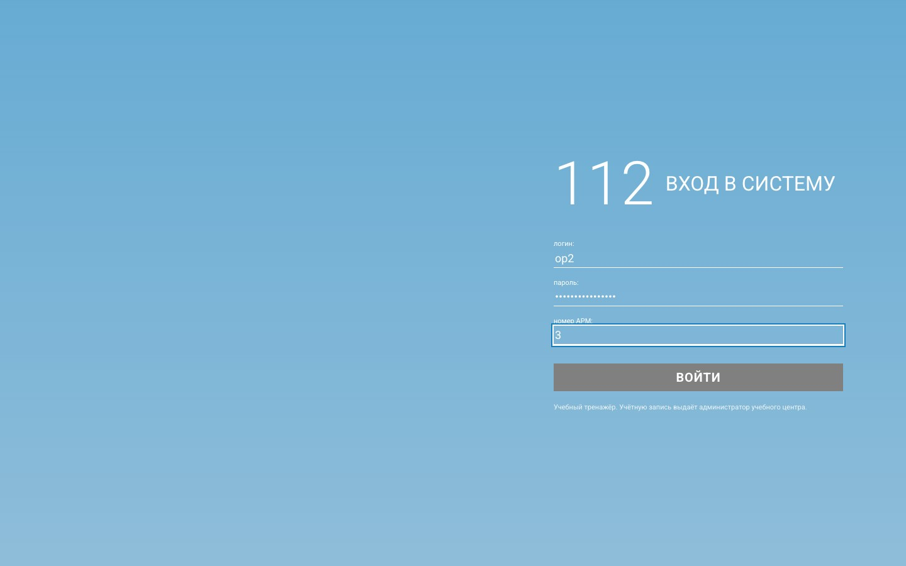

После пяти неверных паролей подряд вход временно закрывается — подождите несколько минут или обратитесь к администратору.

# Обучение интерфейсу

При первом входе тренажёр рассказывает, как всё устроено: сначала обзор, затем на каждом экране — пошаговые подсказки с подсветкой кнопок. Нажимайте **далее** или **пропустить обучение**.

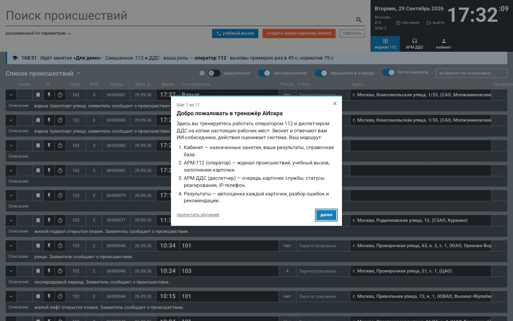

Пока вы впервые читаете подсказки на карточке 112 и в АРМ ДДС, учебные таймеры стоят и это время не идёт в оценку.

Повторить подсказки:

- в кабинете — **пройти обучение заново**;
- в АРМ-112 и АРМ ДДС — **обучение** в правом верхнем углу или **?** на нижней панели карточки.

# Кабинет обучающегося

Кабинет открывается после входа.

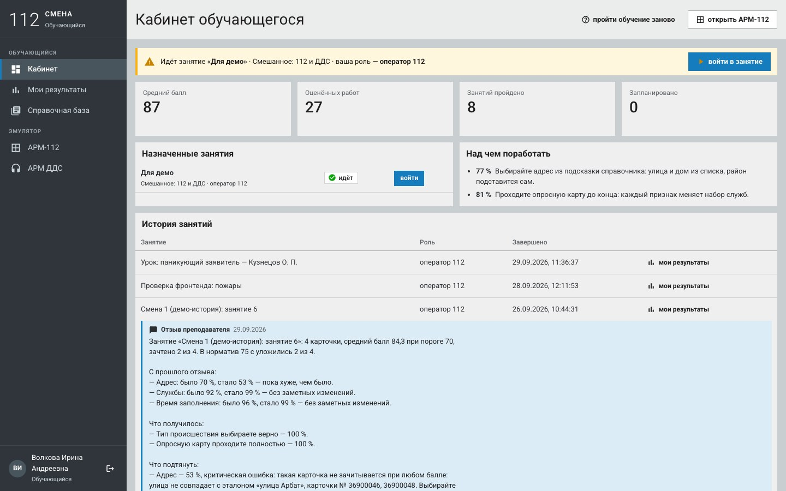

| Блок | Что в нём |
|---|---|
| Баннер занятия | Если идёт занятие — его название, тип и ваша роль. **войти в занятие** откроет нужное рабочее место |
| Плитки | Средний балл, число оценённых работ, пройденных и запланированных занятий |
| Назначенные занятия | Идущие и запланированные занятия с вашей ролью |
| Над чем поработать | Советы по самым слабым критериям и ваш средний результат по каждому |
| История занятий | Пройденные занятия и отзывы преподавателя |

## История занятий и отзыв преподавателя

Под занятием, по которому преподаватель оставил отзыв, появляется блок **Отзыв преподавателя**: итог занятия, что получилось, что подтянуть и следующий шаг. **мои результаты** открывает подробный разбор занятия.

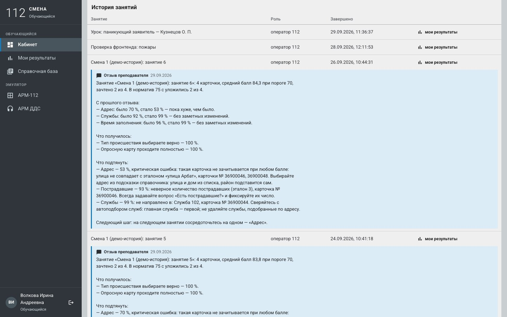

# Работа оператором 112

## Журнал происшествий

**АРМ-112** (или **открыть АРМ-112** в кабинете) открывает журнал происшествий — список ваших карточек, новые сверху.

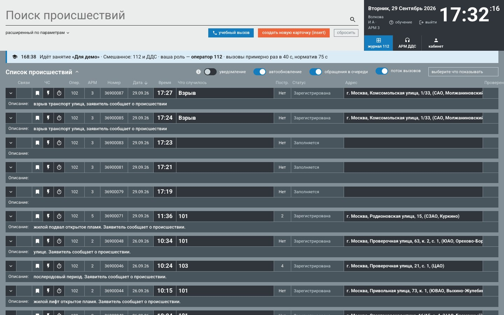

- **Поиск происшествий** — по номеру, адресу, телефону или описанию; «расширенный по параметрам» — фильтр по датам.
- **учебный вызов** — вам позвонит ИИ-заявитель; так можно тренироваться и без занятия.
- **создать новую карточку (insert)** — пустая карточка без звонка.
- Во время занятия под строкой поиска виден баннер занятия, а вызовы приходят сами, примерно с заданным интервалом. Переключатель **поток вызовов** останавливает и возобновляет их.
- Чтобы открыть карточку, щёлкните «Что случилось» или дважды щёлкните строку. Стрелка слева разворачивает описание.

Разделы вверху справа: **журнал 112**, **АРМ ДДС**, **кабинет**.

## Входящий вызов

Когда звонит заявитель, вверху появляется окно «Входящий звонок с номера…». Нажмите **Ответить** — откроется карточка 112 с номером звонящего и окно разговора.

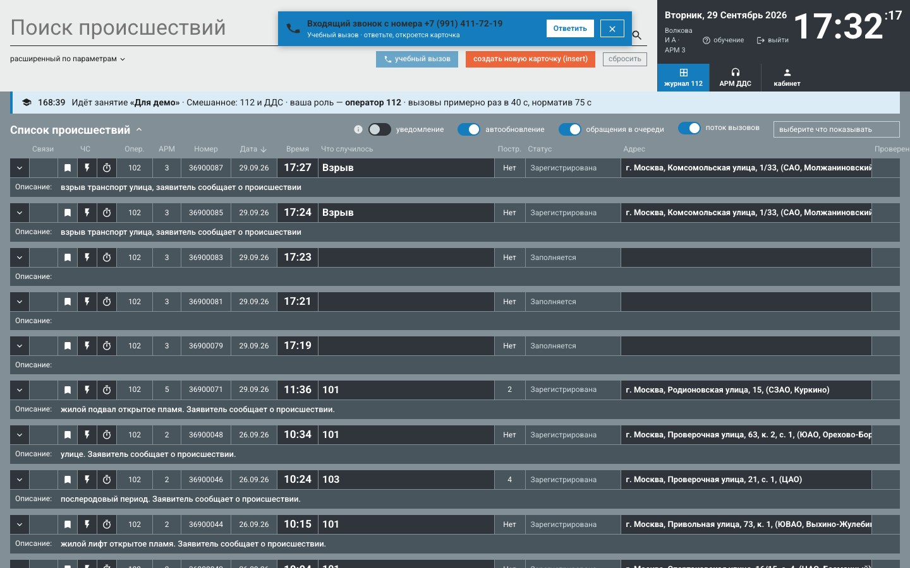

## Разговор с заявителем

Окно разговора — справа внизу карточки. Задавайте вопросы по порядку: **адрес → что случилось → пострадавшие → ФИО**.

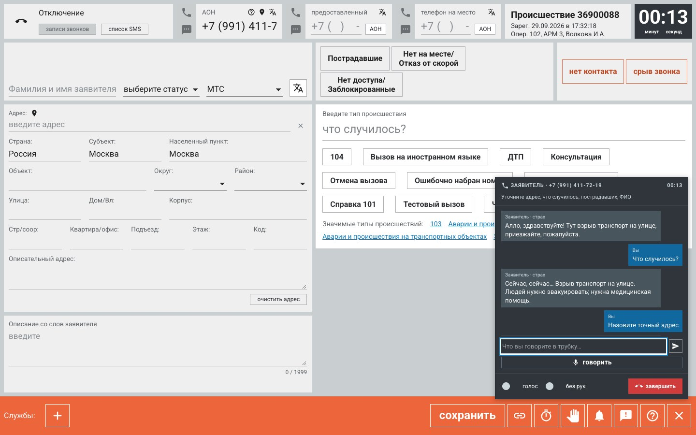

| Способ | Как |
|---|---|
| Текстом | Напишите реплику в поле «Что вы говорите в трубку…» и нажмите Enter |
| Голосом | Нажмите **говорить**, скажите фразу и нажмите **готово** — она распознается и уйдёт заявителю |
| голос | Заявитель отвечает вслух; по голосу слышно волнение |
| без рук | Микрофон слушает весь звонок, фразы распознаются сами; начнёте говорить — заявитель замолчит |

Заявитель ведёт себя как живой человек. «Я вас слышу», «помощь уже едет», «оставайтесь на линии» его успокаивают. «Успокойтесь» и «быстрее» — наоборот. Его состояние видно в подписи у реплики, например «страх, 7/10». Когда всё выяснили, нажмите **завершить**.

## Адрес

Начните вводить улицу и номер дома в поле «Адрес» (Alt+A) и выберите дом из подсказки. Округ, район и координаты заполнятся сами.

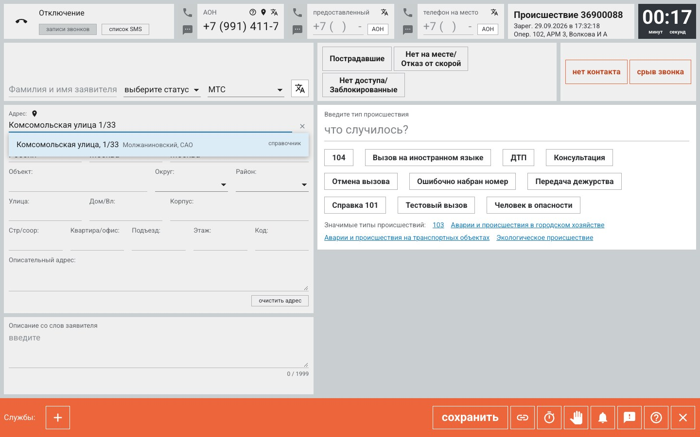

После выбора адреса открывается карта с точкой вызова. Закройте её крестиком или клавишей Esc. Квартиру, подъезд, этаж и код домофона вводите вручную.

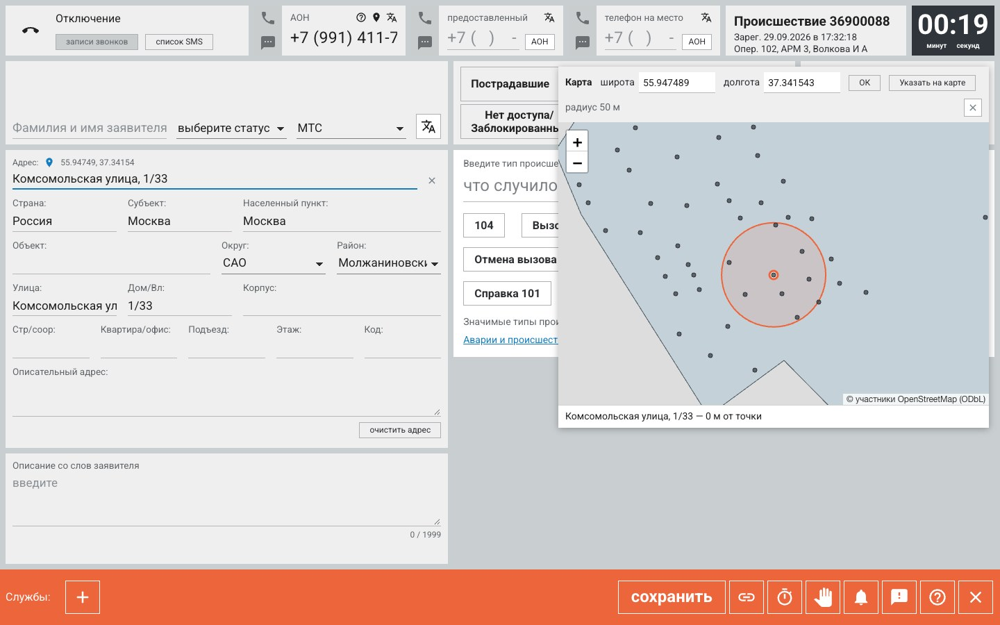

## Что случилось и опросная карта

1. В поле «Что случилось?» (Alt+T) найдите тип по слову: «пожар», «ДТП», «газ», «взрыв».
2. Ниже появится опросная карта. Отвечайте на вопросы до конца: от ответов зависит набор служб.

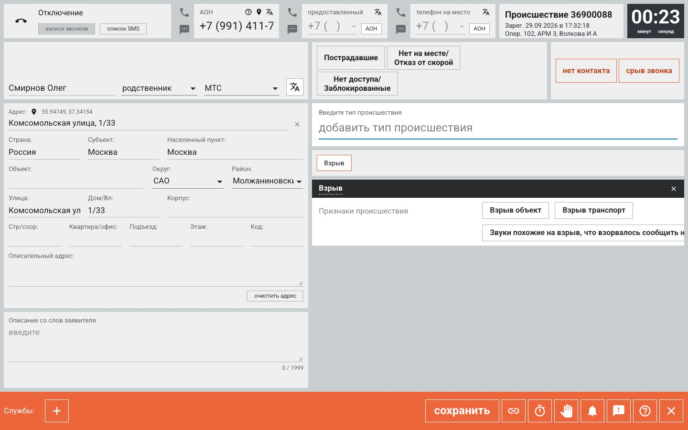

3. Заполните заявителя (Alt+Q): фамилию и имя, статус (очевидец, пострадавший, родственник…) и канал связи.
4. Если есть пострадавшие, отметьте **Пострадавшие** (Alt+P) и укажите их число.
5. Напишите **описание** (Alt+O) своими словами, со слов заявителя: что, где, угроза людям.

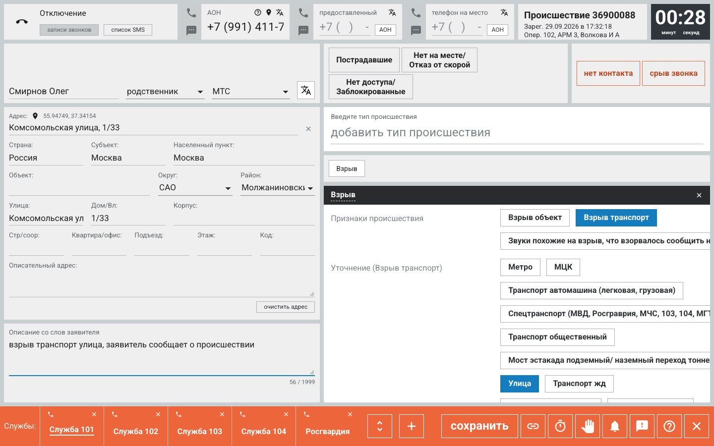

Службы на оранжевой панели внизу подбираются сами — по типу, ответам опросной карты и адресу. Основная служба подчёркнута. **+** добавляет службу вручную (Alt+Z), **⇕** показывает второй ряд служб.

Если заявитель не на связи, справа вверху есть **нет контакта** и **срыв звонка** — карточка сохранится без данных.

## Сохранение

Нажмите **сохранить** (Alt+S). Если не заполнено обязательное поле, тренажёр подскажет, какое именно. Подсказка закрывается щелчком.

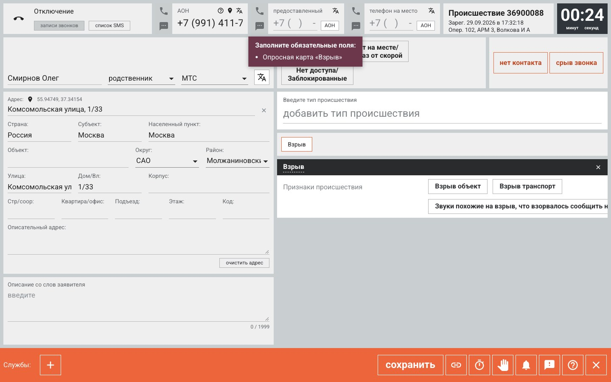

Когда всё заполнено, откроется **Список оповещаемых служб**. Проверьте его и нажмите **оповестить и сохранить карточку** — карточка уйдёт в службы. **вернуться к заполнению** — продолжить правку.

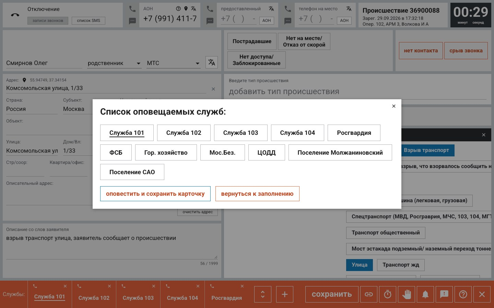

## Автооценка

Сразу после сохранения на карточке появляется **Автооценка**: итоговый балл, «зачтено» или «не зачтено» и полоса по каждому критерию. Под критерием с потерями — что именно не так.

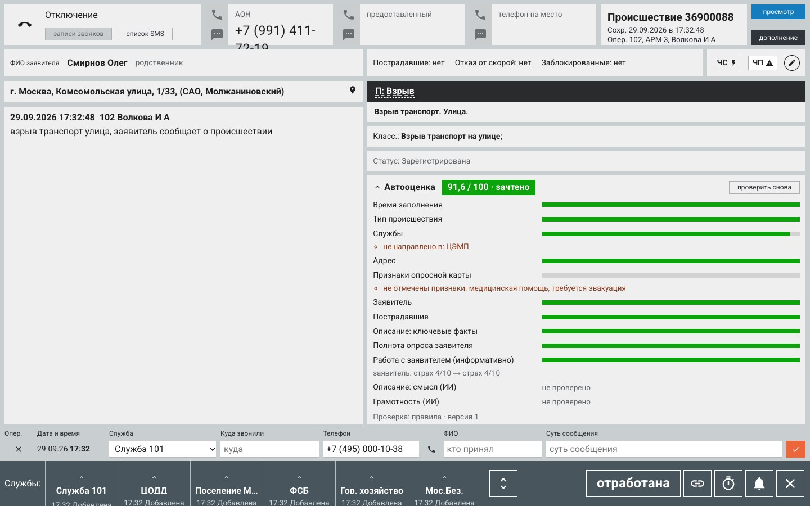

Критерии оператора 112 и их вес в итоговом балле:

| Критерий | Вес | Что проверяется |
|---|---|---|
| Тип происшествия | 3 | Тот же тип классификатора, что в эталоне |
| Службы | 2 | Все нужные службы, главная — первой |
| Адрес | 2 | Улица, дом и район совпадают с эталоном |
| Признаки опросной карты | 1 | Отмечены все нужные признаки |
| Заявитель, Пострадавшие | по 1 | ФИО и статус заявителя, наличие и число пострадавших |
| Описание: ключевые факты | 1 | В описании есть главные факты вызова |
| Полнота опроса заявителя | 1 | Спросили адрес, что случилось, пострадавших |
| Время заполнения | 1 | Карточка сохранена в норматив — 75 секунд |
| Описание: смысл, Грамотность | 1 и 0,5 | Проверяет ИИ; без модели — «не проверено» и в балл не входят |
| Работа с заявителем | — | Информативно: успокаивали ли заявителя; в балл пока не входит |

Порог «зачтено» — 70 баллов, если преподаватель не задал другой. Критическая ошибка, например не та служба или не тот адрес, означает «не зачтено» при любом балле.

После сохранения:

- **отработана** (Alt+S) — отметить, что работа с карточкой закончена; дальше её проверяет преподаватель;
- **дополнение** — дописать в карточку новые сведения, если заявитель перезвонил;
- **разговор с заявителем** — посмотреть, как шёл разговор и что меняло состояние заявителя.

Если преподаватель **вернул карточку на доработку**, его комментарий будет виден в карточке и в кабинете.

## Горячие клавиши АРМ-112

Зажмите Alt — рядом с полями появятся подсказки клавиш.

| Клавиша | Действие |
|---|---|
| Insert | Новая карточка |
| Alt+Q | Заявитель |
| Alt+P | Пострадавшие |
| Alt+A | Адрес |
| Alt+T | Что случилось? |
| Alt+O | Описание |
| Alt+Z | Добавить службу |
| Alt+S | Сохранить; в сохранённой карточке — «отработана» |
| Esc | Закрыть карточку |

# Работа диспетчером ДДС

## Выбор службы

**АРМ ДДС** открывает выбор службы. На занятии службу назначает преподаватель: она указана в баннере занятия и в кабинете. Найдите её поиском или в списке и нажмите на неё. **Продолжить** откроет последнюю службу.

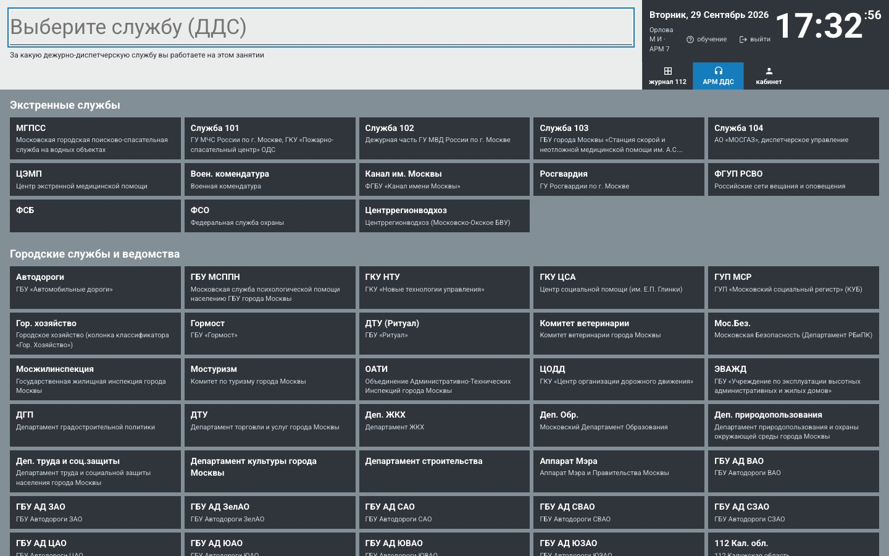

## Реестр карточек службы

В реестре — карточки, поступившие в вашу службу от оператора 112, новые сверху.

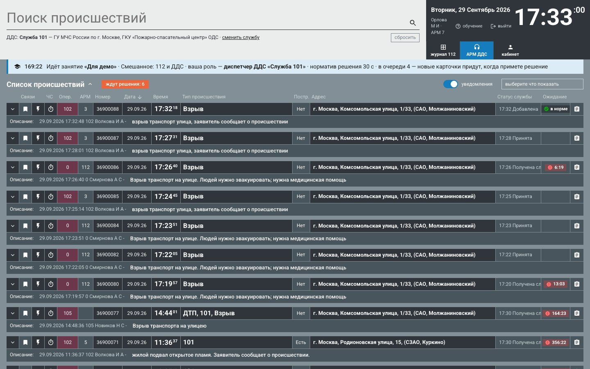

- **ждут решения** — сколько карточек ещё не принято. Начинайте с тех, что ждут дольше.
- **Ожидание** — таймер до вашего решения «Принята» или «Не принята». Норматив — 30 секунд, таймер идёт у всех карточек очереди сразу.
- **уведомления** — звук и подсветка новых карточек; справа — фильтр по статусу службы.
- Откройте карточку двойным щелчком или значком справа. При открытии служба получает статус «Получена службой».

## Карточка ДДС

Карточка от 112 открывается только для чтения: диспетчер не исправляет её и не добавляет службы. Читайте адрес, описание и ответы опросной карты.

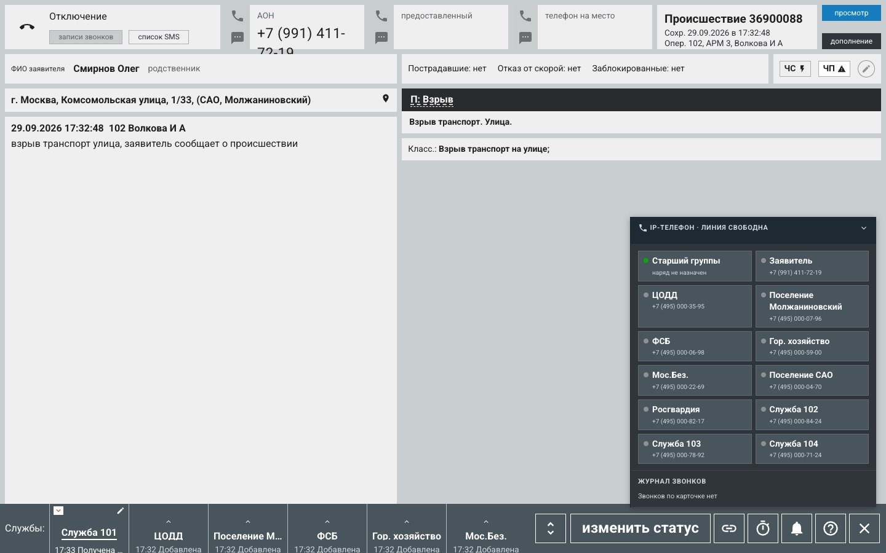

Внизу — плитки служб. Плитка вашей службы подчёркнута и показывает её текущий статус. Щелчок по плитке открывает историю статусов, карандаш — смену статуса. Остальные плитки показывают, какие ещё службы получили карточку.

## Статусы реагирования

Нажмите **изменить статус** (или карандаш на плитке своей службы), выберите статус, заполните номер наряда и комментарий и нажмите галочку.

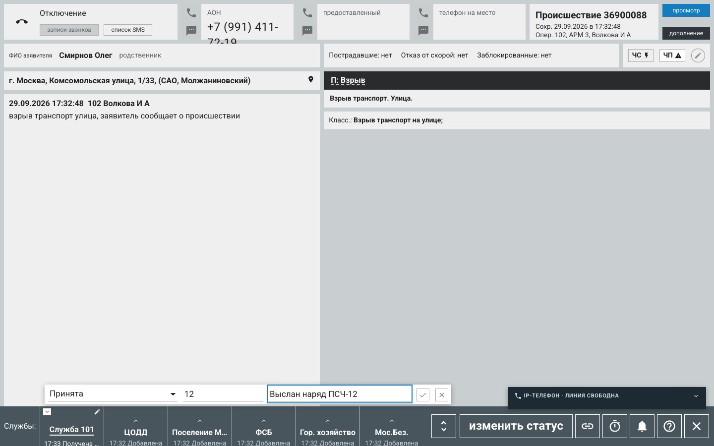

| Шаг | Статус | Когда ставить |
|---|---|---|
| 1 | Принята или Не принята | Сразу после прочтения карточки, в норматив 30 с. «Принята» — с номером наряда и комментарием; «Не принята» — с причиной |
| 2 | Начало реагирования | Наряд выехал |
| 3 | Прибытие | Старший группы доложил о прибытии |
| 4 | Проведение работ | Работы начаты |
| 5 | Работы завершены | Работы окончены |
| — | Отказ от выполнения работ | На любом шаге, если работы невозможны |

К каждому статусу — короткий деловой комментарий: кто выехал, что обнаружено. Ставьте статусы по порядку, после доклада бригады.

## IP-телефон

Панель **IP-телефон** справа внизу — звонки старшему группы (по номеру наряда), заявителю и другим службам карточки. Бригада и сама звонит с докладами: отвечайте и после доклада ставьте статус. Разговор идёт так же, как с заявителем: текстом, голосом или без рук.

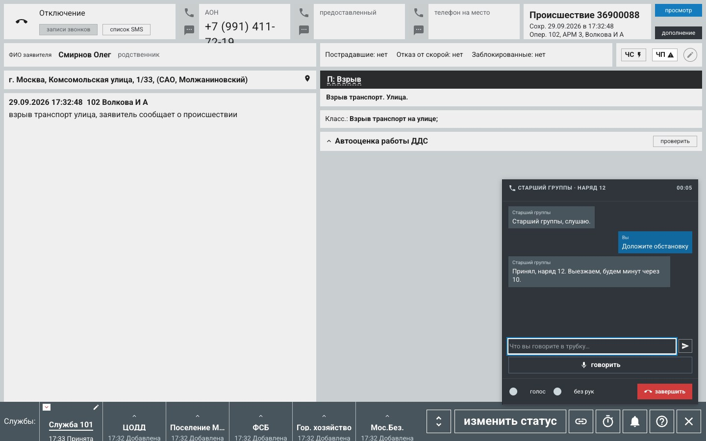

Работу диспетчера оценивают так:

| Критерий | Вес |
|---|---|
| Решение «Принята / Не принята» совпадает с эталоном | 3 |
| Время реакции в норматив 30 с | 2 |
| Порядок и полнота статусов до «Работы завершены» | 2 |
| Номер наряда при «Принята» | 1 |
| Комментарии к статусам | 1 |
| Звонки старшему группы | 1 |
| Регламентность формулировок (ИИ) | 1 |
| Грамотность (ИИ) | 0,5 |

# Результаты

## Мои результаты

**Мои результаты** в меню кабинета — вся ваша история оценок.

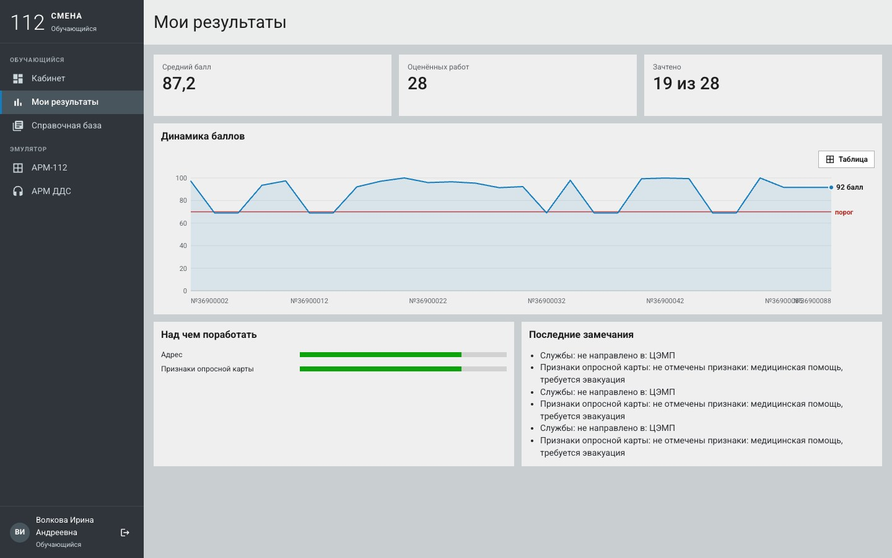

- средний балл, число оценённых работ и зачтённых;
- график «Динамика баллов» с линией порога;
- **Над чем поработать** — самые слабые критерии;
- **Комментарии преподавателя** — к карточкам, где преподаватель поставил свой балл;
- **Последние замечания** автооценки.

## Результаты занятия и отзыв преподавателя

**Кабинет → История занятий → мои результаты** открывает разбор одного занятия.

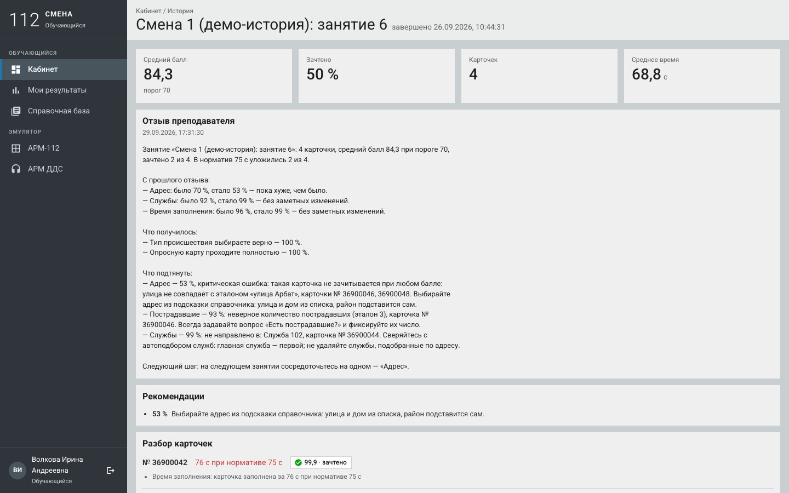

- плитки: средний балл, доля зачтённых карточек, число карточек и среднее время;
- **Отзыв преподавателя** — итог занятия, что получилось, что подтянуть и следующий шаг;
- **Рекомендации** — советы по слабым критериям этого занятия;
- **Разбор карточек** — каждая карточка: время против норматива, балл, замечания и комментарий преподавателя.

Отзыв появляется, когда преподаватель его сохранит. Он может его дополнить — вы всегда видите последнюю версию.

# Справочная база

**Справочная база** в меню кабинета — всё, что может понадобиться на смене.

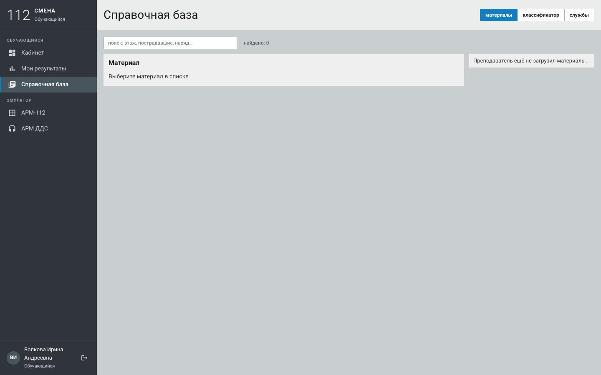

| Раздел | Что в нём |
|---|---|
| материалы | Инструкции, памятки и методички, которые загрузил преподаватель; поиск по тексту |
| классификатор | Типы происшествий, признаки и службы; поиск по слову: пожар, дым, ДТП, газ |
| службы | Службы и ДДС города с телефонами |

# Как получить высокий балл

1. **Опрашивайте по порядку**: адрес → что случилось → пострадавшие → ФИО. Не заканчивайте разговор раньше времени.
2. **Адрес — только из подсказки справочника.** Адрес, набранный вручную, может не совпасть с эталоном и не подключить территориальные службы.
3. **Проходите опросную карту до конца** — каждый признак меняет набор служб.
4. **Не удаляйте службы**, подобранные автоматически; главная служба — первой.
5. **Успокаивайте заявителя**: «я вас слышу», «помощь уже едет». Спокойный заявитель отвечает точнее.
6. **Укладывайтесь в норматив**: карточка 112 — 75 секунд, решение ДДС — 30 секунд. Помогают горячие клавиши.
7. **Читайте отзыв преподавателя** и начинайте следующее занятие с его «следующего шага».
8. **Работайте по регламенту**: порядок действий — как в инструкции по заполнению карточки 112 и регламенте ДДС, формулировки в описании и комментариях к статусам — деловые («выслан наряд», «работы завершены»), без бытовой речи. Инструкции — в справочной базе, раздел «материалы».

# Частые вопросы

**Не приходят вызовы на занятии.** Проверьте, что включён **поток вызовов** и что вы вошли в занятие с баннером «Идёт занятие». Вне занятия нажмите **учебный вызов**.

**Не работает кнопка «говорить».** Разрешите браузеру доступ к микрофону. Если распознавание речи не подключено, пишите реплики текстом.

**Карточка не сохраняется.** Прочитайте подсказку «Заполните обязательные поля» — в ней перечислено, чего не хватает.

**Нет оценки за карточку.** Оценку по занятию запускает преподаватель; в разборе занятия такие карточки помечены «не оценена».

**Нужно повторить подсказки.** В кабинете — **пройти обучение заново**, в АРМ — **обучение** или **?**.
