# Общие сведения

## Назначение

АИскра — учебный тренажёр оператора системы-112 и диспетчера дежурно-диспетчерской службы (ДДС). Обучающиеся работают на копиях рабочих мест: АРМ-112 и АРМ ДДС. Заявителей, старших групп и диспетчеров других служб играет искусственный интеллект. Действия обучающихся система оценивает сама по эталону сценария.

Преподаватель в тренажёре:

- готовит сценарии вызовов: генерирует их и утверждает;
- создаёт занятия, назначает роли и проводит занятие, наблюдая за классом;
- разбирает результаты: автооценка, экспертная правка, отзыв каждому обучающемуся;
- следит за динамикой и готовностью к допуску;
- загружает учебные материалы и проверяет карточки в журнале 112.

## Рабочее место

- Браузер Google Chrome, Яндекс Браузер или Microsoft Edge последней версии.
- Экран шириной от 1280 точек. Кабинет преподавателя работает и на планшете, и на телефоне, но разбирать отчёты удобнее на большом экране.
- Адрес тренажёра и учётную запись выдаёт администратор учебного центра.

## Как читать руководство

Названия кнопок и полей даны так, как они написаны на экране: «оценить все карточки». Путь по меню записан через стрелку: **Занятия → отчёт**.

# Вход в систему

1. Откройте адрес тренажёра в браузере.
2. Введите **логин** и **пароль**. Поле «номер АРМ» преподавателю заполнять не нужно.
3. Нажмите **ВОЙТИ**.

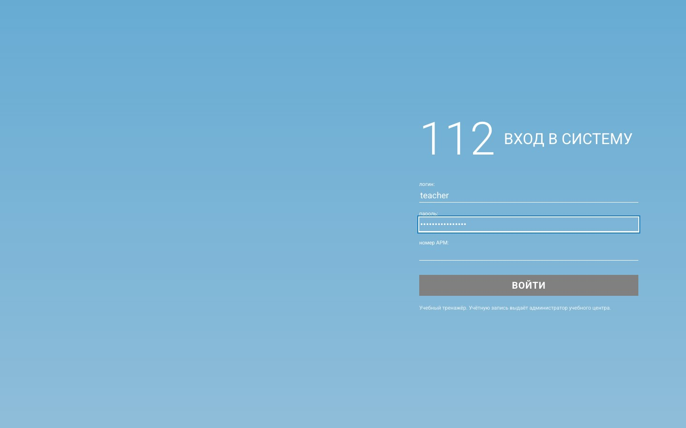

После пяти неверных паролей подряд учётная запись временно блокируется — подождите несколько минут или обратитесь к администратору. Чтобы выйти, нажмите значок выхода рядом со своим именем внизу левого меню.

# Обучение интерфейсу

При первом входе тренажёр показывает обзор кабинета, а на каждом важном экране — короткие подсказки с подсветкой нужных кнопок. Нажимайте **далее**, чтобы перейти к следующей подсказке, или **пропустить обучение**, чтобы закрыть все подсказки сразу.

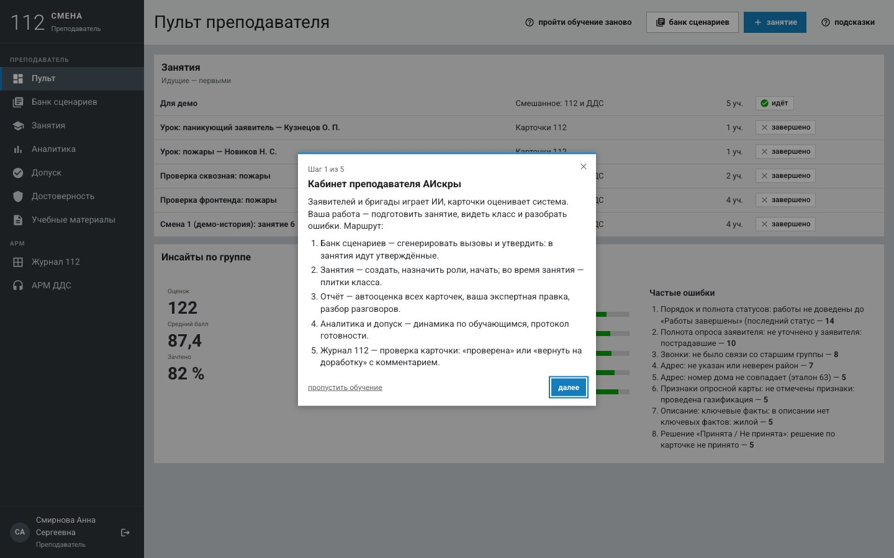

Вернуть подсказки можно в любой момент:

- **подсказки** в правом верхнем углу — подсказки текущего экрана;
- **пройти обучение заново** на пульте — всё обучение с начала.

# Пульт преподавателя

Пульт — стартовая страница кабинета.

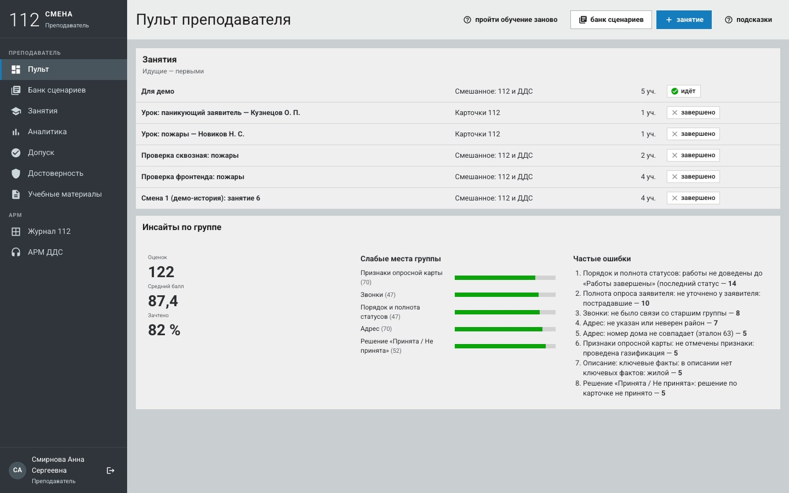

| Элемент | Что показывает |
|---|---|
| Занятия | Ваши занятия: идущие — первыми. Щелчок по строке открывает занятие |
| Инсайты по группе | Число оценок, средний балл, доля зачтённых, слабые места группы и самые частые ошибки |
| банк сценариев, + занятие | Быстрый переход к подготовке сценариев и к созданию занятия |

Левое меню ведёт ко всем разделам. Разделы «Журнал 112» и «АРМ ДДС» открывают рабочие места — там преподаватель проверяет карточки.

# Банк сценариев

Сценарий — это учебный вызов: легенда заявителя (что он знает и как говорит) и эталон — правильно заполненная карточка 112 и правильные действия ДДС. В занятия попадают только **утверждённые** сценарии.

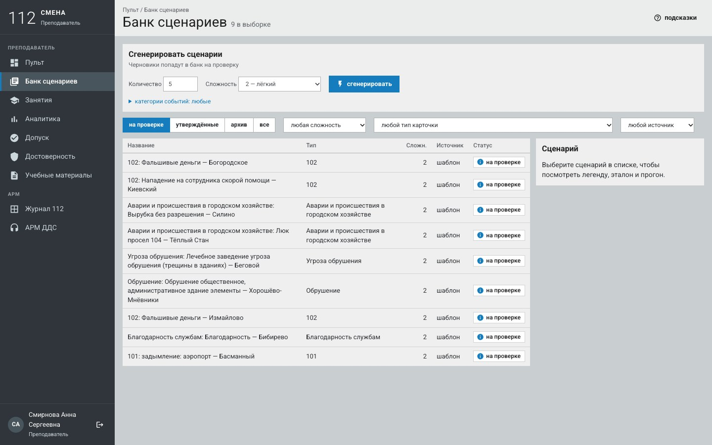

## Сгенерировать сценарии

1. В блоке «Сгенерировать сценарии» укажите **количество** и **сложность** (от 1 — спокойный заявитель до 5 — паника, путаница в адресе).
2. При необходимости раскройте **категории событий** и отметьте группы классификатора, например «Пожары и задымления».
3. Нажмите **сгенерировать**. Новые сценарии появятся в списке со статусом «на проверке».

## Проверить и утвердить

Нажмите строку сценария — справа откроется карточка сценария.

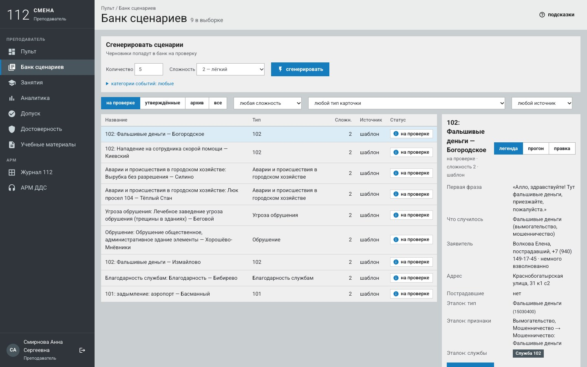

| Вкладка | Что проверить |
|---|---|
| легенда | Первая фраза заявителя, что случилось, заявитель, адрес, пострадавшие и эталон: тип, признаки, службы |
| прогон | Как заявитель отвечает на типовые вопросы оператора — до того, как сценарий увидят обучающиеся |
| правка | Исправить легенду вручную или написать комментарий и нажать **перегенерировать речь заявителя** |

Если сценарий годится, нажмите **утвердить**. Неудачный сценарий отправьте **в архив** — он пропадёт из подбора, но останется в истории.

Фильтры над списком: статус (на проверке, утверждённые, архив, все), сложность, тип карточки и источник.

# Занятия

## Список занятий

**Занятия** — все ваши занятия с типом, числом участников и статусом: «запланировано», «идёт», «завершено». У завершённых и идущих занятий есть кнопка **отчёт**.

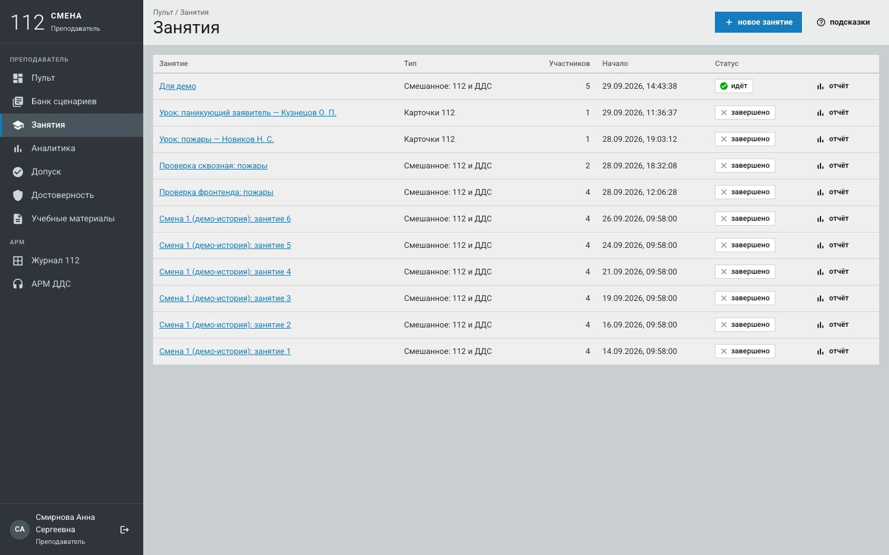

## Создать занятие

Нажмите **новое занятие** и заполните форму.

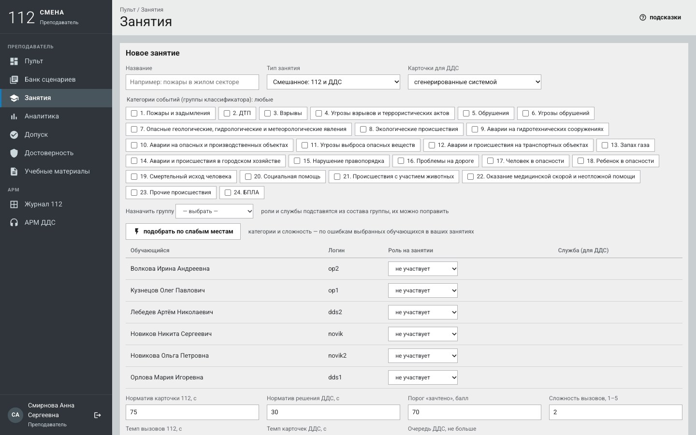

| Поле | Что указать |
|---|---|
| Название | Как занятие будет видно вам и обучающимся, например «Пожары в жилом секторе» |
| Тип занятия | «Карточки 112» — только операторы, «Действия ДДС» — только диспетчеры, «Смешанное: 112 и ДДС» — вместе |
| Карточки для ДДС | «сгенерированные системой», «от операторов 112 занятия» или «смешанный» |
| Категории событий | Группы классификатора, из которых придут вызовы. Ничего не отмечено — любые |
| Назначить группу | Подставить состав учебной группы; роли и службы можно поправить |
| подобрать по слабым местам | Тренажёр сам выберет категории и сложность по ошибкам выбранных обучающихся |
| Роль на занятии | Для каждого обучающегося: не участвует, оператор 112 или ДДС. Для ДДС выберите службу |
| Нормативы | Карточка 112 — 75 с, решение ДДС — 30 с (ПП РФ № 1931). Можно изменить |
| Порог «зачтено» | Минимальный балл, по умолчанию 70 |
| Сложность, темп, очередь | Сложность вызовов 1–5, как часто приходят вызовы 112 и карточки ДДС, сколько карточек ДДС может ждать одновременно |

Нажмите **создать**. Занятие появится со статусом «запланировано».

## Провести занятие

Откройте занятие и нажмите **начать занятие**. С этого момента операторам поступают учебные вызовы, а диспетчерам — карточки в темпе, заданном в форме. Обучающиеся видят баннер занятия в кабинете и на рабочем месте.

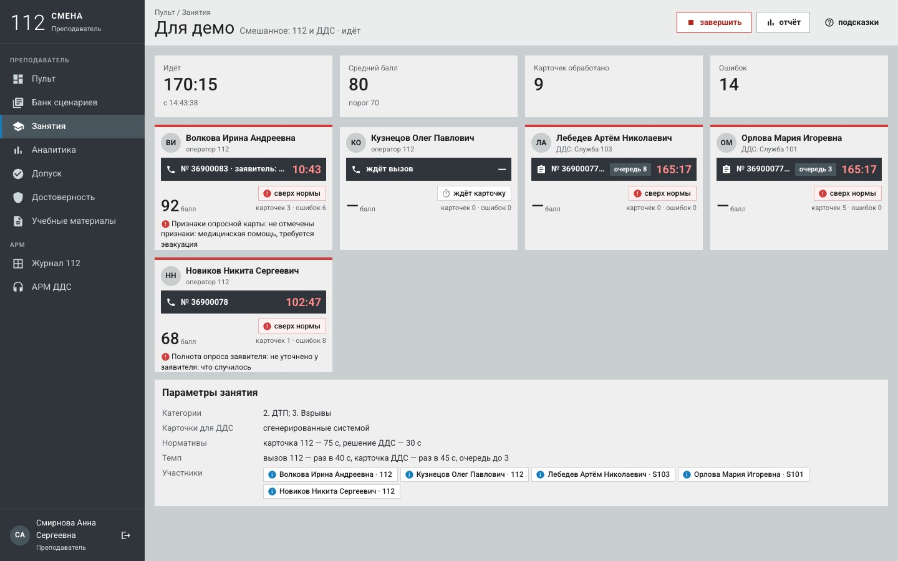

На экране мониторинга:

- сверху — время занятия, средний балл, число обработанных карточек и ошибок;
- ниже — плитка на каждого участника: текущая карточка и таймер против норматива (зелёный — в норме, жёлтый — близко, красный — «сверх нормы»), балл, число карточек и ошибок, последнее замечание;
- если оператор разговаривает с заявителем, на плитке видно состояние заявителя, например «паника, 9/10».

Экран обновляется сам. Чтобы закончить занятие, нажмите **завершить**. Начать и завершить занятие можно только один раз.

# Результаты занятия

## Отчёт по занятию

**Занятия → отчёт.** Первым делом нажмите **оценить все карточки** — тренажёр сравнит каждую карточку с эталоном. Повторный запуск пересчитает баллы, но экспертная правка сохранится.

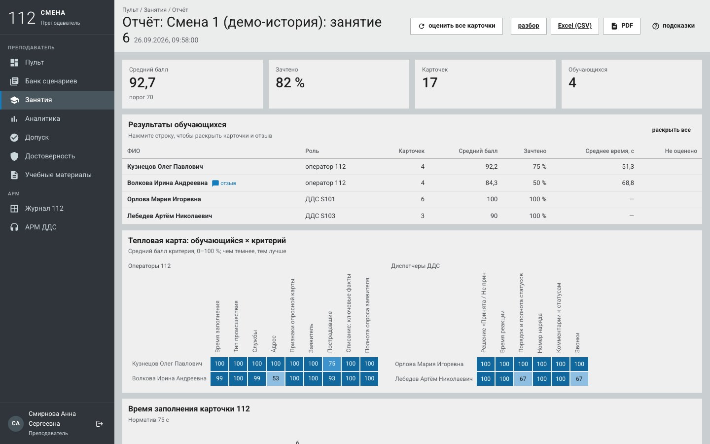

Сверху — средний балл, доля зачтённых, число карточек и обучающихся. Ниже — таблица «Результаты обучающихся».

## Карточки обучающегося и экспертная правка

Нажмите строку обучающегося — раскроются его карточки: номер, тип, время против норматива, балл и замечания автооценки.

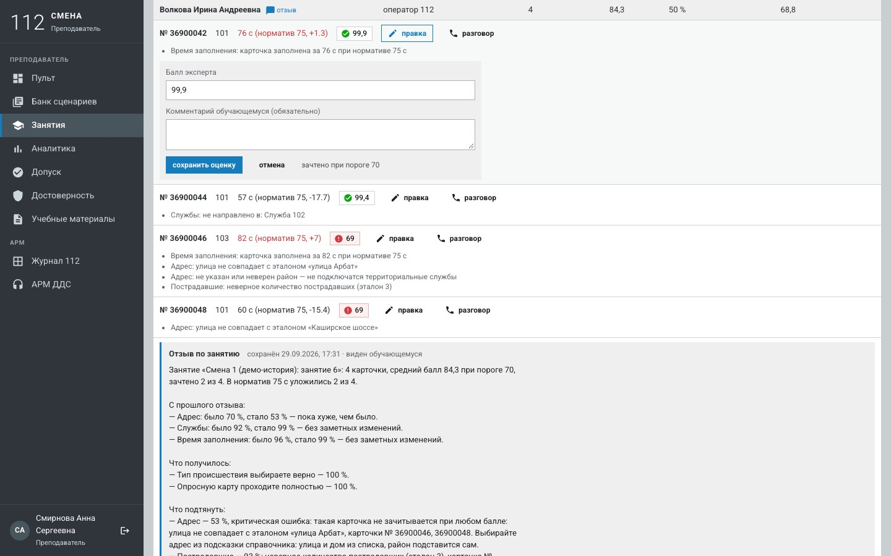

Если вы не согласны с автооценкой, нажмите **правка** у карточки, поставьте свой балл и обязательно напишите комментарий обучающемуся. Нажмите **сохранить оценку**.

> Экспертная оценка окончательна: повторная автооценка её не меняет. Каждая правка записывается в журнал аудита, а комментарий виден обучающемуся.

## Разбор разговора с заявителем

Кнопка **разговор** у карточки оператора 112 показывает, как шёл разговор:

- график напряжения заявителя от 0 до 10 с отметкой «паника»;
- все реплики по порядку;
- у реплик оператора — что изменило состояние заявителя: «успокоил» (зелёным) или «обесценил», «давил» (красным).

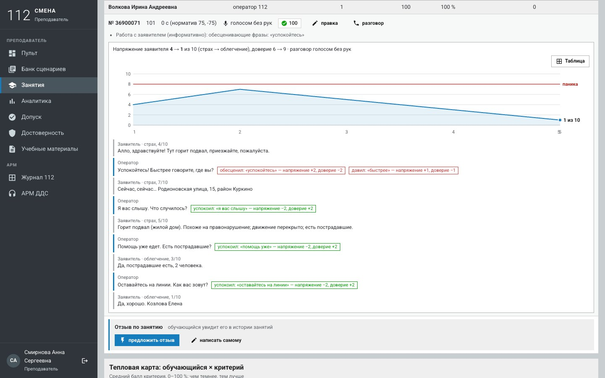

Показатель «Работа с заявителем» пока информативный: в итоговый балл он не входит.

## Отзыв по занятию

Под карточками обучающегося — блок **Отзыв по занятию**. Отзыв — это ваша обратная связь по уроку в целом: что получилось и что нужно подтянуть. Обучающийся увидит его в своём кабинете.

1. Нажмите **предложить отзыв** — ИИ подготовит черновик по фактам занятия.
2. Прочитайте и поправьте текст.
3. Нажмите **сохранить отзыв**.

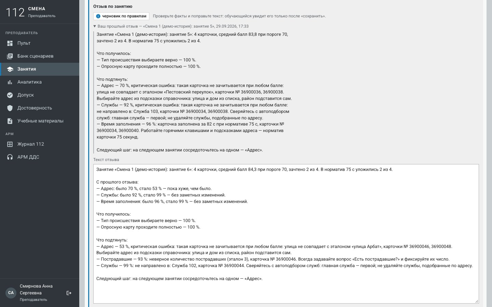

Черновик всегда устроен одинаково:

| Часть | Содержание |
|---|---|
| Итог | Сколько карточек, средний балл при пороге, сколько зачтено, сколько уложились в норматив |
| С прошлого отзыва | Если вы уже писали этому обучающемуся: что просили подтянуть и как изменилось — «было 70 %, стало 53 %» |
| Что получилось | Одна-две сильные стороны |
| Что подтянуть | До трёх пунктов: критические ошибки первыми, с примером замечания, номерами карточек и советом |
| Следующий шаг | Одно действие на следующее занятие |

Над текстом видно, кто составил черновик: «черновик ИИ» с названием модели или «черновик по правилам», если модель не подключена. Раскрывающаяся строка **Ваш прошлый отзыв** показывает, что вы писали в прошлый раз.

Черновик ничего не публикует: обучающийся видит только сохранённый вами текст. Отзыв можно **изменить** в любой момент, каждое сохранение записывается в журнал аудита. Кнопка **написать самому** открывает пустое поле без черновика.

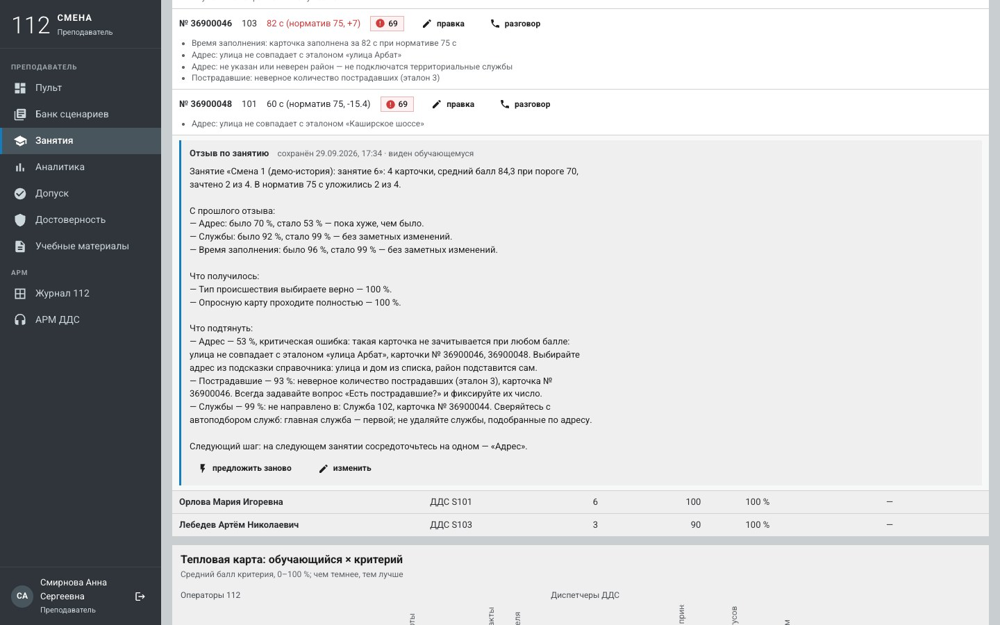

У обучающегося с отзывом рядом с ФИО появляется отметка «отзыв». Отзыв попадает и в выгрузку Excel, и в печать PDF.

## Тепловая карта и графики

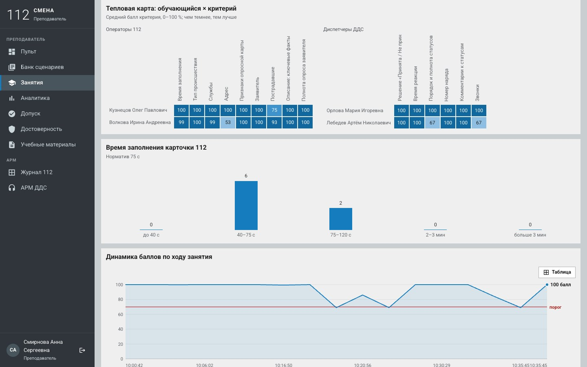

- **Тепловая карта** — средний балл каждого критерия по каждому обучающемуся, 0–100 %; чем темнее клетка, тем лучше. Операторы 112 и диспетчеры ДДС показаны отдельно: у них разные критерии.
- **Время заполнения карточки 112** — сколько карточек заполнено за 40 с, 40–75 с, 75–120 с и дольше.
- **Динамика баллов** — балл каждой карточки по ходу занятия и линия порога.

## Выгрузка

- **Excel (CSV)** — таблица всех карточек: время, отклонение от норматива, балл, замечания, комментарий эксперта, отзыв.
- **PDF** — печать страницы отчёта; все карточки при печати раскрываются сами.

## Разбор занятия

**Отчёт → разбор** — одна страница для подведения итогов с группой (ГОСТ Р 22.7.01, п. 3.12.3).

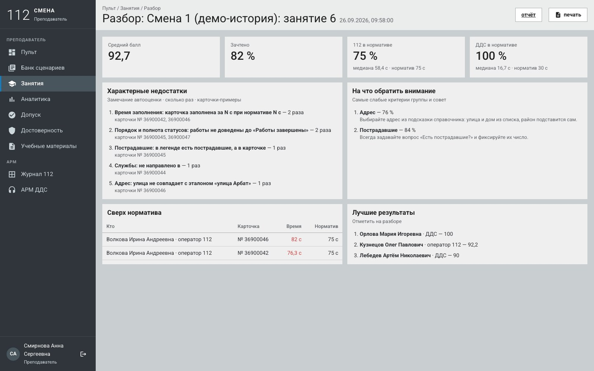

На странице: характерные недостатки группы с номерами карточек и фамилиями, слабые критерии с советом, группы происшествий ниже порога, превышения норматива и лучшие результаты. Кнопка **печать** выводит страницу на принтер.

# Аналитика

## Норматив и факт

**Аналитика** — время работы против нормативов ПП РФ № 1931 по всем вашим занятиям за выбранный период.

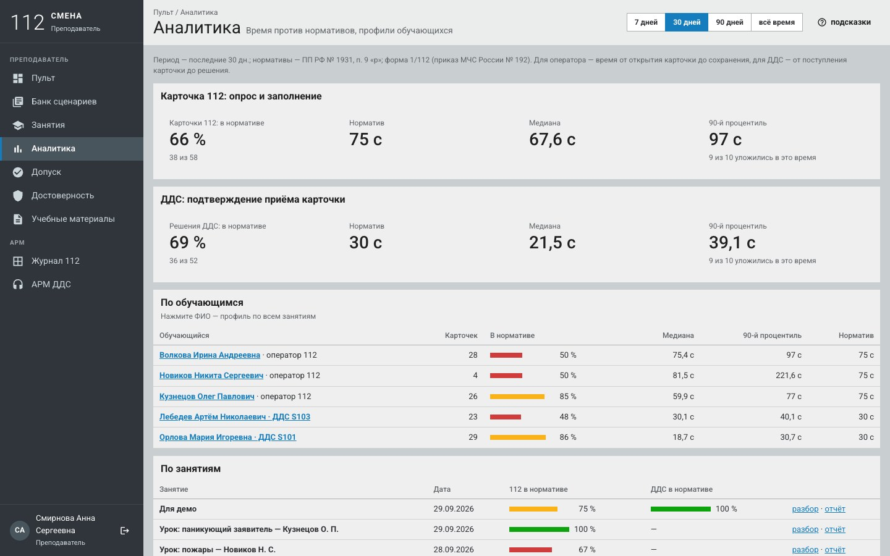

- Доля карточек 112 в нормативе 75 с и решений ДДС в нормативе 30 с, медиана и 90-й процентиль времени.
- Таблицы по обучающимся и по занятиям. Щелчок по ФИО открывает профиль обучающегося.

## Профиль обучающегося

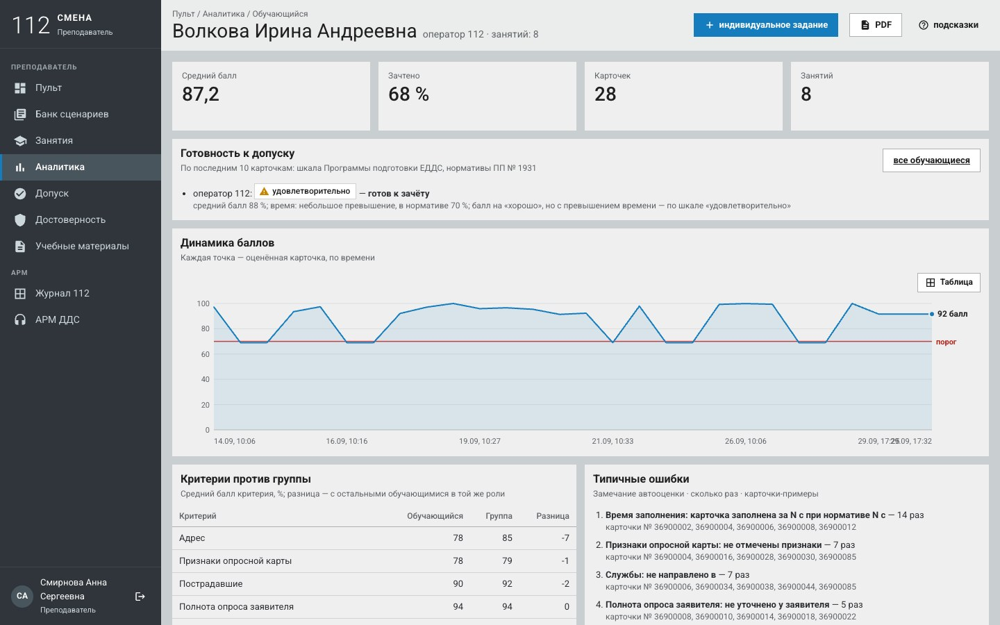

Профиль собирает все занятия обучающегося у вас:

- готовность к допуску;
- динамика баллов;
- критерии в сравнении с группой;
- типичные ошибки с номерами карточек;
- какие группы происшествий отработаны, а какие ещё не встречались;
- балл по сложности заявителя и рекомендации для инструктажа.

Кнопка **индивидуальное задание** открывает форму нового занятия, уже заполненную по слабым местам этого обучающегося. **PDF** печатает профиль.

## Готовность к допуску

**Допуск** — оценка каждого обучающегося по шкале Программы подготовки ЕДДС по последним 10 карточкам:

| Оценка | Условие |
|---|---|
| отлично | 90–100 % и задача выполнена полностью и в срок |
| хорошо | 75–90 %, в срок |
| удовлетворительно | 60–75 %, с небольшим превышением времени |
| неудовлетворительно | меньше 60 % или время значительно превышено |

Если карточек меньше пяти, оценка — «недостаточно данных».

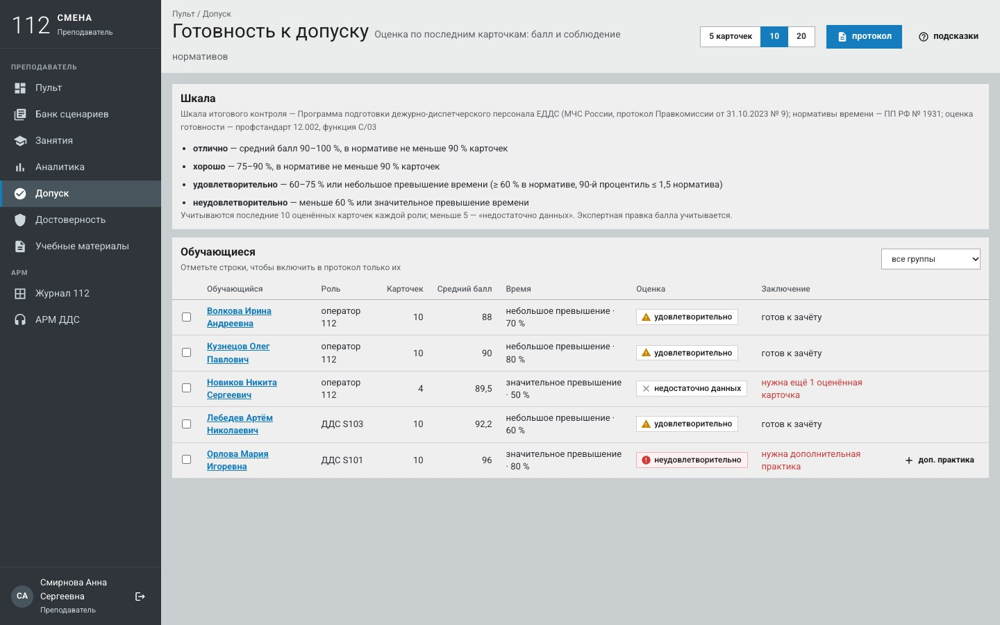

Отметьте строки и нажмите **протокол** — откроется печатная форма протокола.

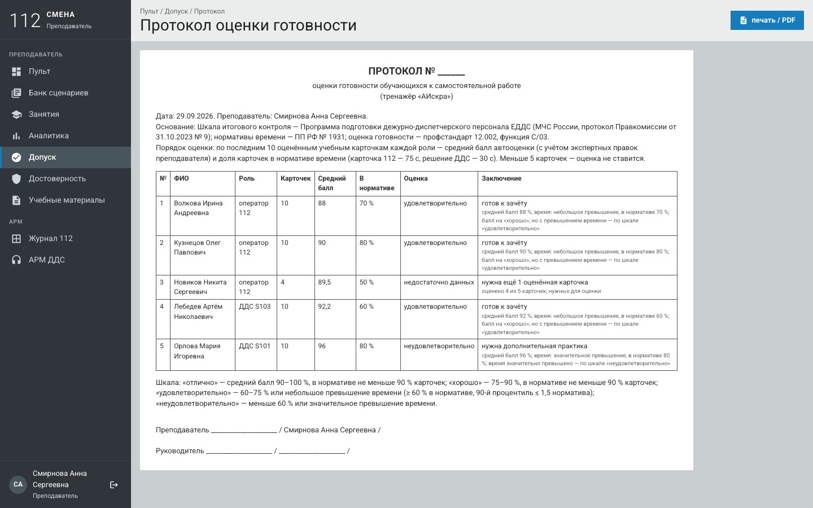

## Достоверность автооценки

**Достоверность** показывает, насколько можно доверять автооценке: сколько внесённых ошибок она находит, насколько согласована генерация сценариев и как часто эксперты соглашаются с автооценкой. Блок «Как читать» на странице объясняет каждый показатель.

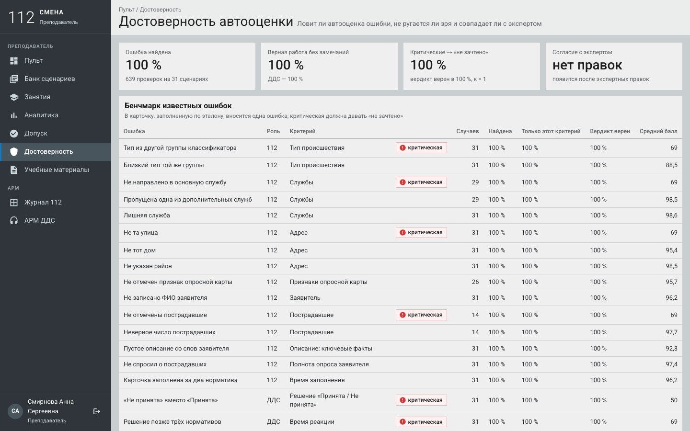

# Учебные материалы

**Учебные материалы** — инструкции, памятки и методички для обучающихся и для генерации сценариев.

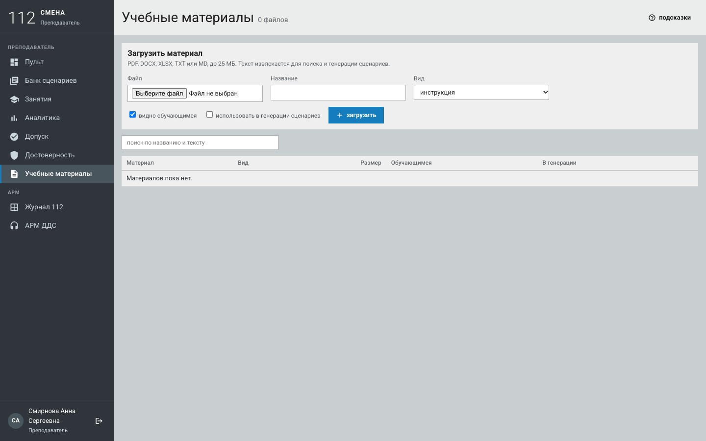

1. Выберите **файл** (PDF, DOCX, XLSX, TXT или MD), укажите **название** и **вид** материала.
2. Отметьте **видно обучающимся** — материал появится в их справочной базе.
3. Отметьте **использовать в генерации сценариев** — выдержки из материала попадут в подсказку для ИИ при генерации.
4. Нажмите **загрузить**.

Отметки в таблице можно менять в любой момент. **удалить** убирает материал насовсем.

# Проверка карточек в журнале 112

Преподаватель проверяет карточки операторов так же, как главный специалист смены.

1. Откройте **Журнал 112** в левом меню.
2. Найдите карточку поиском или по списку. Щёлкните «Что случилось» или дважды щёлкните строку.

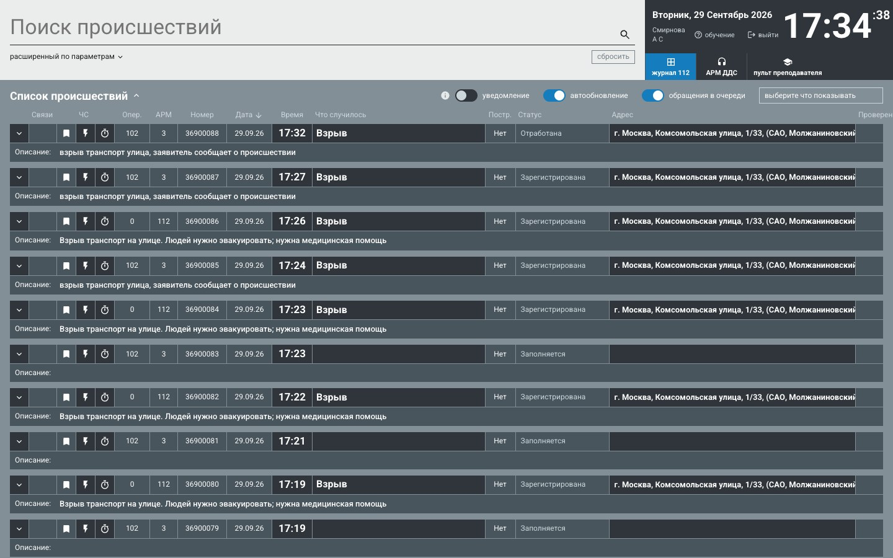

3. Проверяются карточки со статусом «Отработана» — оператор отметил, что закончил работу с ней. Нажмите **Проверена** (Alt+Y), если всё верно, или **Вернуть на доработку** (Alt+N) и напишите комментарий. Автор карточки увидит комментарий в своём кабинете.

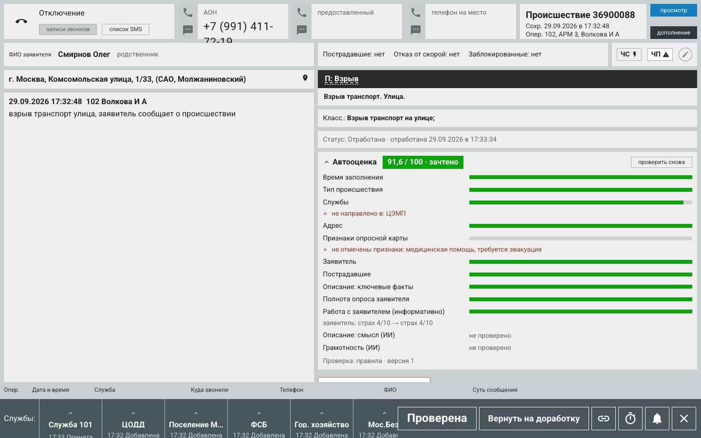

У сохранённой карточки есть кнопка **разговор с заявителем** — тот же разбор разговора, что и в отчёте.

# Частые вопросы

**Обучающийся не видит занятие.** Проверьте, что он назначен участником, а занятие начато: у него должен появиться баннер «Идёт занятие».

**Карточки не оценены.** В отчёте нажмите **оценить все карточки**. Карточку ДДС нельзя оценить, пока диспетчер её не открыл.

**Балл кажется несправедливым.** Раскройте карточку и прочитайте замечания. Если автооценка ошиблась, поставьте экспертный балл через **правка** с комментарием.

**Черновик отзыва — «по правилам», а не от ИИ.** Модель не подключена или не ответила. Черновик по правилам построен из тех же фактов, его тоже можно править.

**Нужно повторить подсказки.** Нажмите **подсказки** на любом экране или **пройти обучение заново** на пульте.
