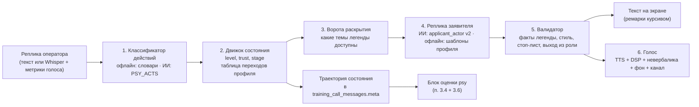

# Воспроизведение психологических состояний в тренажёре: проблемы и решения

Этап 3 исследования. Документ разбирает, что мешает правдоподобно и воспроизводимо сыграть заявителя в стрессе, и какое решение принято в каждом случае. Технические источники — [04_Технологии_источники.md](04_Технологии_источники.md), ссылки вида [Т-§N]. Реализация — [руководство разработчика](../../ai/Психологический_модификатор.md).

## 1. Восемь проблем и решения

| # | Проблема | Почему важно | Решение | Основание |
|---|---|---|---|---|
| 1 | **LLM-актёр слишком кооперативен**: успокаивается за 1–2 хода и выдаёт все факты | обучающийся не встречает трудностей, тренировка теряет смысл, у навыка возникает ложное ощущение прогресса | состояние хранит не модель, а детерминированный движок (`training/domain/psy.py`); ворота раскрытия фактов; асимметрия эскалации и деэскалации; потолок `compliance_cap` | PATIENT-Ψ, CARS, ResistClient, CLPsych 2026 [Т-§1.1] |
| 2 | **Дрейф персонажа**: за 5–8 ходов модель съезжает к своему «нейтральному» стилю | к середине звонка паникующий говорит как справочная | карточка персонажа и текущее состояние заново передаются на **каждом** ходе (системный промпт собирается заново), контекст ограничен 12 репликами, валидатор проверяет стиль | Attractor States 2026, Sim911 [Т-§1.1] |
| 3 | **Выход из роли по безопасности**: модель вставляет «я ИИ», «обратитесь на линию доверия» в суицидальном профиле | звонок ломается именно там, где он важнее всего | учебная рамка в системном промпте; детектор выхода из роли; скриптовые реплики методиста на ключевые этапы P12; стоп-лист способов суицида | arXiv 2604.23445 [Т-§5] |
| 4 | **Воспроизводимость оценки** при стохастической модели | повторный прогон должен давать ту же оценку (п. 3.5, ТЗ «достоверность») | блок оценки считается по действиям оператора и траектории **движка**, а не по тексту модели; seed звонка хранится; ИИ-судья — температура 0 и кеш `exact` | ADR-0003, ADR-0006 |
| 5 | **Изолированный контур без модели** | ТЗ: тренажёр работает офлайн | офлайн-рендер профиля: шаблоны реплик по уровню поверх `applicant_reply`; офлайн-классификатор действий на словарях. Полноценный блок оценки работает офлайн, кроме судьи и голоса | ADR-0003, текущий офлайн-режим п. 3.3 |
| 6 | **Эмоциональный русский TTS на CPU отсутствует** | без голоса теряется главное: плач, крик, одышка | нейтральный быстрый TTS + DSP-постобработка (темп, тон, дрожание, компрессия) + вставки невербальных звуков по ремаркам + фон сцены + телефонный канал. На GPU — модель с управлением эмоцией | [Т-§2, Т-§3] |
| 7 | **Задержка**: LLM + TTS на CPU дают 2–5 с тишины | даже паникующий так не молчит, звонок звучит неестественно | короткие реплики (`max_tokens` 120); синтез по предложениям с потоковой отдачей; мгновенная «заполняющая» невербалика (всхлип, «алло?!») на время генерации; кеш синтеза по (текст, голос, профиль) | [Т-§7] |
| 8 | **Нагрузка на обучающихся** в тяжёлых профилях | RCT: практика без обратной связи снижает эмпатию; риск травматизации | категория `sensitive`, опт-ин, уровни интенсивности, пауза, обязательный разбор | INACSL, SPRC, Louie 2025 [Т-§5] |

## 2. Конвейер реплики

Шаги 1–3 и 5 — детерминированные. Модель участвует только в шагах 1 (по желанию) и 4, а при её ошибке тренажёр переходит в офлайн, как в текущем `Actors._ask`.

## 3. Голос

### 3.1. Контракт реплики для синтеза
Модель или офлайн-рендер возвращает текст с **ремарками из закрытого списка**. Ремарки убираются из озвучиваемого текста и превращаются в звуковые события. На экране они показываются курсивом: так обучающийся видит состояние, даже если голос выключен.

| Ремарка | Звук | Где |
|---|---|---|
| `[плачет]`, `[всхлипывает]` | вставка всхлипа, дрожание тона 5–8 Гц на следующей фразе | до или после фразы |
| `[кричит]` | +6 дБ, компрессия, лёгкий клиппинг | вся фраза |
| `[задыхается]`, `[тяжело дышит]` | вставка одышки, ускорение темпа | до фразы |
| `[пауза]` | тишина 1,5–3 с | место ремарки |
| `[шёпотом]` | −10 дБ, снижение высоких частот | вся фраза |
| `[шум: <сцена>]` | смена фона: `fire`, `street`, `crash`, `crowd`, `siren`, `apartment` | до конца реплики |
| `[кладёт трубку]` | короткие гудки, звонок завершается со стороны заявителя | конец |

Параметры голоса считаются из состояния движка, а не из текста модели:

| Уровень | Темп (SSML rate / множитель) | Тон | Громкость | Прочее |
|---|---|---|---|---|
| 1 | medium / 1,0 | medium | 0 дБ | — |
| 2 | medium / 1,05 | +1 полутон | 0 | — |
| 3 | fast / 1,12 | +2 | +2 дБ | дрожание по профилю |
| 4 | fast / 1,2 | +3 | +4 дБ | одышка между фразами |
| 5 | x-fast / 1,3 | +4 | +6 дБ, компрессия | обрывы фраз |

Профили торможения (P06 апатия, P07 ступор, P12 суицид) используют обратную шкалу: `slow` или `x-slow`, тон −2, громкость −4 дБ, паузы. Профиль задаёт `voice.direction: up | down`.

### 3.2. Выбор движка
Ограничения: изолированный контур, CPU по ТЗ (6 ядер, 32 ГБ), GPU RTX 4060 8 ГБ только на демо-стенде. Сравнение — [Т-§2.1].

| Вариант | Движок | Эмоции | Лицензия | Когда |
|---|---|---|---|---|
| **CPU, по умолчанию** | **Vosk-TTS** (vosk-model-tts-ru) + DSP | через DSP и вставки | Apache-2.0 | поставка заказчику |
| CPU, лучше звучит | Silero v5 + SSML `prosody` + DSP | через SSML, DSP и вставки | CC BY-NC-SA 4.0 — **только с решением юриста** о некоммерческом учебном использовании в ГБУ или с коммерческой лицензией авторов | пилот |
| **GPU, демо** | **Qwen3-TTS 0.6B/1.7B** (эмоция текстовой инструкцией, детский и пожилой голос по описанию) или **Chatterbox Multilingual** (`exaggeration` ← уровень) | нативно | Apache-2.0 / MIT | демо-стенд |
| Резерв | синтез речи браузера (текущий `CallPanel.speak`) + `rate`/`pitch` из `voice` | темп и тон | — | нет серверного TTS |

Некоммерческие лицензии (XTTS-v2, F5-TTS_RUSSIAN, Fish/OpenAudio) не подходят. Модели без русского (Zonos, Dia, Orpheus) — тоже. Решение фиксируется в [ADR-0012](../../adr/0012-psy-modifier.md) и в конфиге `ai.tts`.

### 3.3. Невербальные звуки, фон, канал
- **Банк звуков:** `data/sounds/` — 10–30 сэмплов на категорию (`sob`, `sniff`, `gasp`, `pant`, `scream`, `sigh`, `laugh`, фоны сцен). Только CC0 и CC BY (Freesound с фильтром по лицензии, клипы FSD50K с CC0 и CC BY, MUSAN). Атрибуции ведутся в `data/sounds/ATTRIBUTION.md`. ESC-50, Deeply NVD и NC-клипы FSD50K не брать [Т-§3.1].
- **DSP:** numpy и scipy или audiomentations (MIT). pedalboard (GPL-3.0) — только после решения юриста [Т-§3.2].
- **Телефонный канал:** ресемплинг 8 кГц → полоса 300–3400 Гц → μ-law (G.711) → опционально потери пакетов. Канал маскирует артефакты синтеза, и фон проходит через ту же цепочку, что и голос [Т-§3.3].

## 4. Анализ голоса оператора
Голосовой ввод уже есть: запись до 30 с, Whisper (`docs/ai/Голосовой_ввод.md`). Для критерия `psy_voice` (навык К10) сервер считает метрики **из той же записи до распознавания** и не хранит аудио — только числа:
- **темп:** слов в секунду по отметкам времени слов из faster-whisper, если сервер их отдаёт; иначе — длительность записи на число слов;
- **громкость:** RMS в дБ FS и её изменение к базовой линии (среднее по первым 3 репликам оператора);
- **паузы:** время от конца реплики заявителя (конец воспроизведения TTS) до начала записи;
- **перебивание:** запись начата, пока воспроизводится реплика заявителя (фиксирует клиент);
- **распознавание эмоций по речи не используется:** русские модели на реальной речи ненадёжны, например точность 0,10 у модели на актёрском корпусе [Т-§4]. openSMILE — только исследовательская лицензия.

Базовая линия своя у каждого обучающегося: сравнение с абсолютным порогом несправедливо к людям с быстрой или громкой речью [О-E11].

## 5. Бюджет задержки (CPU, оценка)
| Шаг | Время | Как сократить |
|---|---|---|
| Классификатор действий, офлайн | < 5 мс | — |
| Классификатор действий, ИИ (`local_small`) | 0,5–1,5 с | только офлайн по умолчанию; ИИ — по флагу `psy.llm_acts` |
| Реплика ИИ (`qwen2.5:3b`, 60–120 токенов) | 1,5–4 с | короткие реплики, кеш `task` по (сценарий, профиль, уровень, раскрытые темы) |
| TTS Vosk или Silero, одна фраза | 0,1–0,4 с | по предложениям, кеш по хешу (текст, голос, уровень) |
| DSP + канал | < 50 мс | — |
| **Итого до первого звука** | **2–5 с** | «заполняющая» невербалика сразу после отправки реплики оператора: всхлип, одышка, «алло?!» из банка |

## 6. Что не делаем и почему
- **Не обучаем свою модель сопротивления** (SFT или RL, как в ResistClient): нет данных и времени. Внешнего движка состояния достаточно [Т-§1.1].
- **Не используем записи реальных звонков 112**: персональные данные, 152-ФЗ. Few-shot примеры пишет методист.
- **Не оцениваем эмоцию оператора классификатором**: это ненадёжно и несправедливо (§4).
- **Не делаем голосовые клоны реальных людей**: для GPU-варианта нужны референсы актёров с письменным согласием [Т-§2.3].
